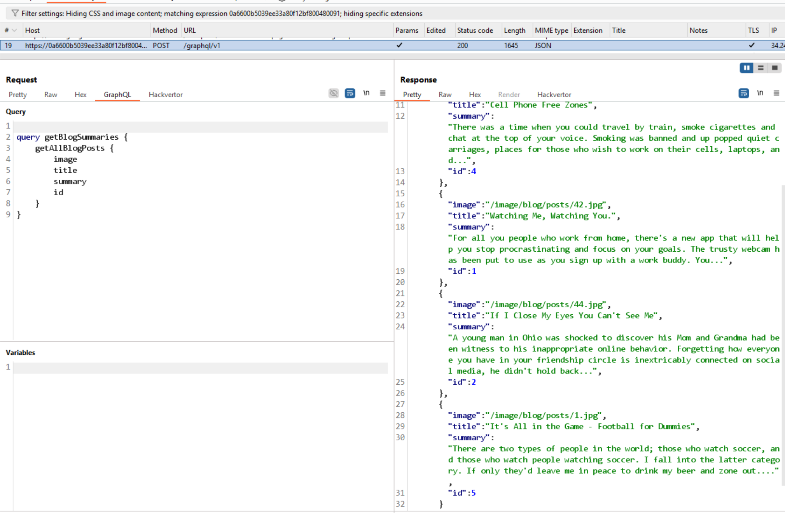

# Lab: Accessing private GraphQL posts



send to repeater -> right click -> GraphQL -> Set introspection query -> send. reponse trar veef:
```
{
    "kind": "OBJECT",
    "name": "BlogPost",
    "description": null,
    "fields": [
    {
        "name": "id",
        "description": null,
        "args": [],
        "type": {
        "kind": "NON_NULL",
        "name": null,
        "ofType": {
            "kind": "SCALAR",
            "name": "Int",
            "ofType": null
        }
        },
        "isDeprecated": false,
        "deprecationReason": null
    },
    {
        "name": "image",
        "description": null,
        "args": [],
        "type": {
        "kind": "NON_NULL",
        "name": null,
        "ofType": {
            "kind": "SCALAR",
            "name": "String",
            "ofType": null
        }
        },
        "isDeprecated": false,
        "deprecationReason": null
    },
    {
        "name": "title",
        "description": null,
        "args": [],
        "type": {
        "kind": "NON_NULL",
        "name": null,
        "ofType": {
            "kind": "SCALAR",
            "name": "String",
            "ofType": null
        }
        },
        "isDeprecated": false,
        "deprecationReason": null
    },
    {
        "name": "author",
        "description": null,
        "args": [],
        "type": {
        "kind": "NON_NULL",
        "name": null,
        "ofType": {
            "kind": "SCALAR",
            "name": "String",
            "ofType": null
        }
        },
        "isDeprecated": false,
        "deprecationReason": null
    },
    {
        "name": "date",
        "description": null,
        "args": [],
        "type": {
        "kind": "NON_NULL",
        "name": null,
        "ofType": {
            "kind": "SCALAR",
            "name": "Timestamp",
            "ofType": null
        }
        },
        "isDeprecated": false,
        "deprecationReason": null
    },
    {
        "name": "summary",
        "description": null,
        "args": [],
        "type": {
        "kind": "NON_NULL",
        "name": null,
        "ofType": {
            "kind": "SCALAR",
            "name": "String",
            "ofType": null
        }
        },
        "isDeprecated": false,
        "deprecationReason": null
    },
    {
        "name": "paragraphs",
        "description": null,
        "args": [],
        "type": {
        "kind": "NON_NULL",
        "name": null,
        "ofType": {
            "kind": "LIST",
            "name": null,
            "ofType": {
            "kind": "NON_NULL",
            "name": null,
            "ofType": {
                "kind": "SCALAR",
                "name": "String"
            }
            }
        }
        },
        "isDeprecated": false,
        "deprecationReason": null
    },
    {
        "name": "isPrivate",
        "description": null,
        "args": [],
        "type": {
        "kind": "NON_NULL",
        "name": null,
        "ofType": {
            "kind": "SCALAR",
            "name": "Boolean",
            "ofType": null
        }
        },
        "isDeprecated": false,
        "deprecationReason": null
    },
    {
        "name": "postPassword",
        "description": null,
        "args": [],
        "type": {
        "kind": "SCALAR",
        "name": "String",
        "ofType": null
        },
        "isDeprecated": false,
        "deprecationReason": null
    }
    ],
    "inputFields": null,
    "interfaces": [],
    "enumValues": null,
    "possibleTypes": null
}
```

-> trường secret cần tìm: `postPassword`

-> thử gửi request với query:
```
query getBlogSummaries {
    getBlogPost (id:3) {
        image
        title
        summary
        id
        postPassword
    }
}
```
