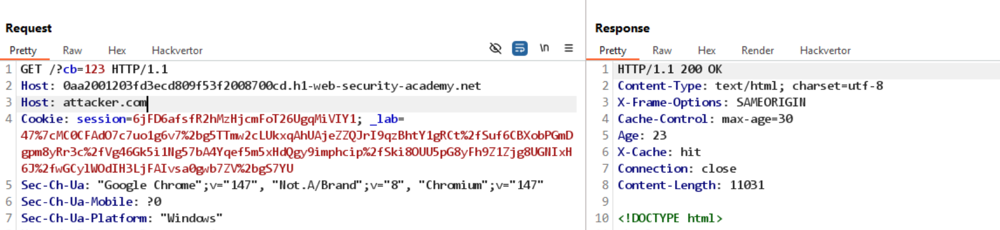
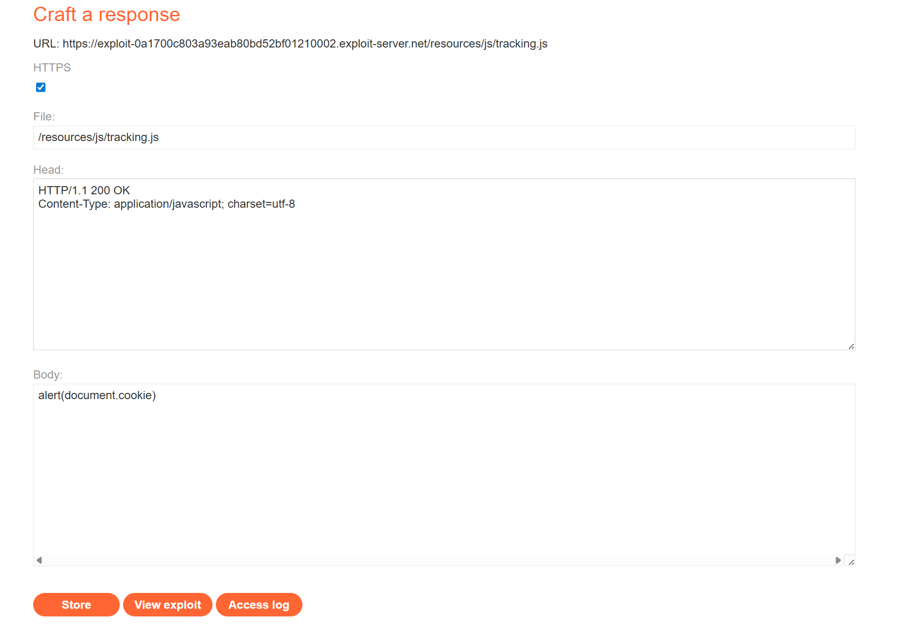

# Lab: Web cache poisoning via ambiguous requests

Mục tiêu: Đánh lừa bộ đệm (cache) để phục vụ tài nguyên JavaScript độc hại từ máy chủ tấn công.

Phát hiện chính:

- Trang chủ tham chiếu `/resources/js/tracking.js` (JS sinh tag ảnh `tracker.gif?page=post`).
- Phản hồi có header `Cache-Control: max-age=30` → phản hồi có thể bị cache.
- Gửi nhiều `Host` header trong cùng request cho phép server chấp nhận host thứ hai mà không lỗi.

Khai thác (tóm tắt):

1. Tạo file JS ác ý trên `exploit-server` (ví dụ: `alert(document.domain)`).
2. Trên exploit server, cấu hình đường dẫn `/resources/js/tracking.js` trả về file JS ác ý (xem `images/exploit.png`).
3. Gửi request có hai Host header:

```
GET / HTTP/1.1
Host: 0aa2001203fd3ecd809f53f2008700cd.h1-web-security-academy.net
Host: exploit-0a1700c803a93eab80bd52bf01210002.exploit-server.net
```


4. Kiểm tra cache: lần đầu `X-Cache: miss, Age: 0`, lần sau thấy `X-Cache: hit` và `Age > 0`.

Ảnh minh họa:




Kết quả: Website bắt đầu phục vụ JS độc hại từ cache, dẫn tới mã độc được thực thi trên trình duyệt nạn nhân.

Ghi chú / khắc phục:

- Không dùng host header không kiểm chứng làm thành phần chính của cache key.
- Áp dụng validation chặt chẽ cho origin/host hoặc tắt cache cho nội dung nhạy cảm.

