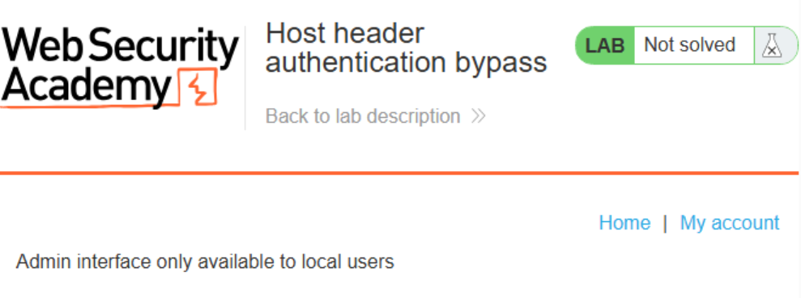
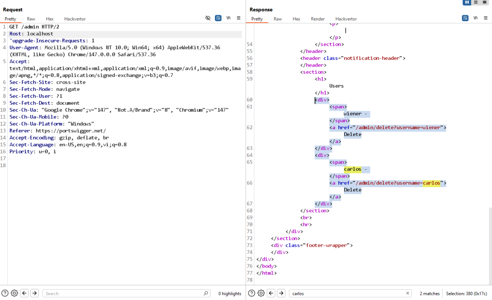

# Lab: Host header authentication bypass

Mục tiêu: Bypass cơ chế xác thực dựa trên Host header để truy cập trang admin nội bộ.

Phát hiện:

- `/robots.txt` khai báo `Disallow: /admin` → tồn tại trang admin.
- Khi truy cập `/admin` với host mặc định sẽ bị chặn, nhưng thay đổi `Host` thành `localhost` có thể hiển thị giao diện admin.



Khai thác (bước thực hiện):

1. Mở `/robots.txt` để xác định điểm admin.

2. Gửi yêu cầu GET tới `/admin` với header `Host: localhost`.

Ví dụ request:

```
GET /admin/delete?username=carlos HTTP/1.1
Host: localhost
```




Kết quả: Truy cập thành công chức năng admin — lab solved.

Khắc phục đề xuất:

- Không dùng Host header client-controlled để quyết định quyền truy cập nội bộ.
- Sử dụng kiểm tra địa chỉ IP thực (remote addr) hoặc kiểm tra header nội bộ (ví dụ từ proxy đáng tin cậy).
