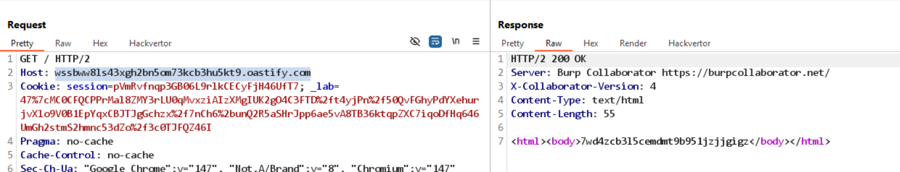
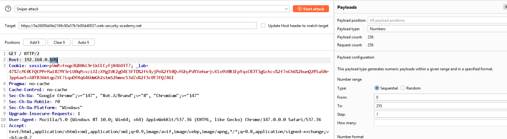
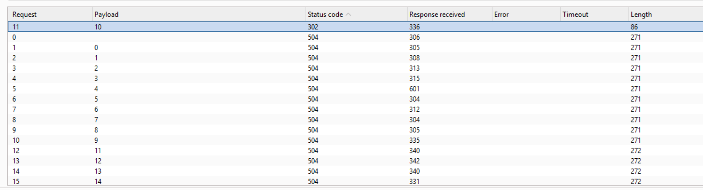
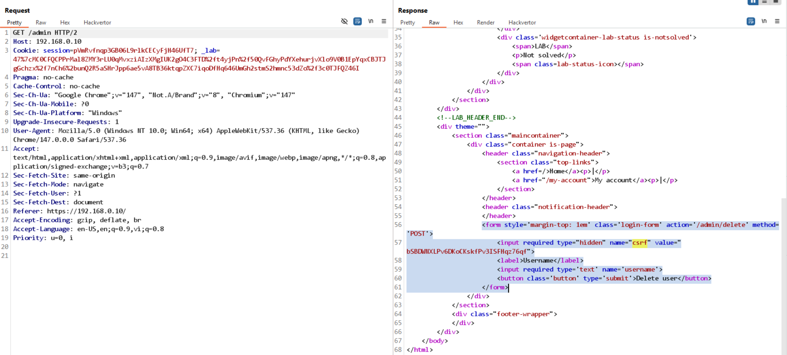

# Lab: Routing-based SSRF

Mục tiêu: Khai thác lỗi routing/host parsing để thực hiện SSRF (gọi tới mạng nội bộ) và truy cập admin panel.

Phát hiện:

- Khi sửa header `Host` thành một URL chứa Burp Collaborator, server thực hiện kết nối tới host đó → ghi nhận DNS/HTTP callback (xem `images/collab.png`).
- Khi sửa header `Host` thành một URL chứa Burp Collaborator, server thực hiện kết nối tới host đó → ghi nhận DNS/HTTP callback (xem `images/collab.png`).



- Có thể gửi request với header Host trỏ tới địa chỉ nội bộ trong dải `192.168.0.0/24`.

Khai thác (các bước):

1. Gửi `GET /` với `Host` là URL của Burp Collaborator để xác nhận callback.
2. Dùng Intruder để quét dải `192.168.0.0/24` bằng cách thay giá trị Host để tìm server đáp ứng (xem `images/intruder.png`).





3. Khi tìm được IP nội bộ trả về giao diện admin, truy cập `/admin` với header `Host: 192.168.0.X`.
4. Gửi POST để xóa user (ví dụ):

```
POST /admin/delete HTTP/2
Host: 192.168.0.10
username=carlos&csrf=bSBDWNXLPv6DKoCKskfPv3ISFHqz76qf
```

Kết quả: Thực thi thành công hành động admin trên host nội bộ → lab solved.



Khắc phục:

- Không dùng header `Host` do client kiểm soát để quyết định routing nội bộ.
- Kiểm tra nguồn yêu cầu (trusted proxy) hoặc lọc chặt địa chỉ đích trước khi thực hiện request server-side.
