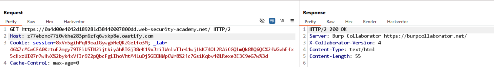
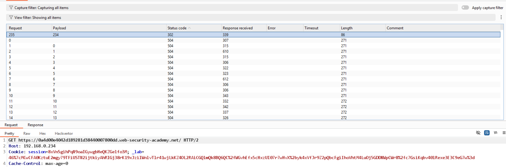
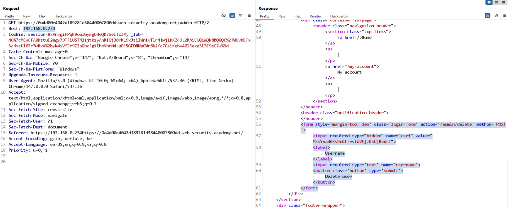

# Lab: SSRF via flawed request parsing

Mục tiêu: Dùng lỗi phân tích request (parsing) để buộc server kết nối tới host do attacker kiểm soát, từ đó truy cập admin nội bộ.

Phát hiện:

- Server sử dụng giá trị `Host` header để xác định host đích khi thực hiện request server-side.
- Khi thay `Host` thành URL của Burp Collaborator, ta nhận được callback (xem `images/collab.png`).



Khai thác (tóm tắt):

1. Xác nhận SSRF bằng cách gửi `Host` là URL collaborator.
2. Dùng Intruder brute-force dải `192.168.0.0/24` bằng cách đặt payload là các IP / Host header.

 3. Khi phát hiện IP nội bộ phản hồi giao diện admin, truy cập `/admin` với `Host: <internal IP>`.

Ví dụ payload POST để xóa user:

```
POST https://0a4d00e4042d189281d38440007800dd.web-security-academy.net/admin/delete HTTP/2
Host: 192.168.0.234
username=carlos&csrf=MKvYnad6KsNoNtzesiWVEjzKkUjHvdcT
```

Kết quả: Thực hiện hành động admin thành công trên host nội bộ → lab solved.



Khắc phục: Validate/whitelist host đích trên server, không dùng header `Host` do client cung cấp để quyết định routing ra ngoài.
