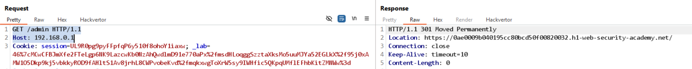
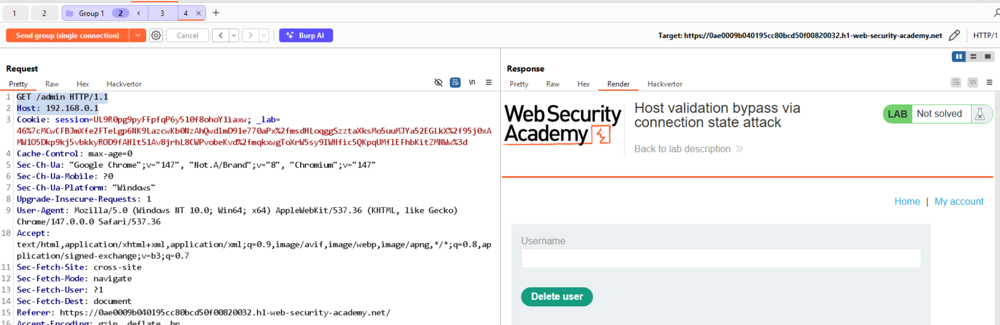

# Lab: Host validation bypass via connection state attack

Mục tiêu: Bypass kiểm tra host bằng cách lợi dụng trạng thái kết nối (connection state) để truy cập admin nội bộ.

Phát hiện:

- Giao tiếp có `timeout=10` ở chế độ HTTP/1.1.
- Gửi `GET /admin` trực tiếp tới `Host: 192.168.0.1` gây lỗi, do server có cơ chế kiểm tra kết nối/host.

  

Khai thác (tóm tắt):

1. Gom nhiều yêu cầu vào một group/connection duy nhất (single connection) trong Burp để thao tác connection state.
2. Gửi chuỗi request phù hợp để khiến server chấp nhận `Host` nội bộ trong connection hiện tại (xem `images/var.png`).

 

3. Khi state phù hợp, gửi POST để thực thi hành động admin, ví dụ:

```
POST /admin/delete HTTP/1.1
Host: 192.168.0.1
csrf=mZUciDRyz0EtS7Xu26Hpp0rArttQvT0i&username=carlos
```

Kết quả: Hành động admin được thực hiện thành công → lab solved.

Khắc phục: Kiểm tra và xác thực host đầu vào mọi lúc, đừng dựa vào trạng thái kết nối hoặc header client-controlled để quyết định quyền truy cập.
