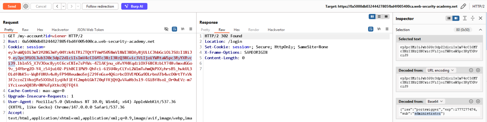
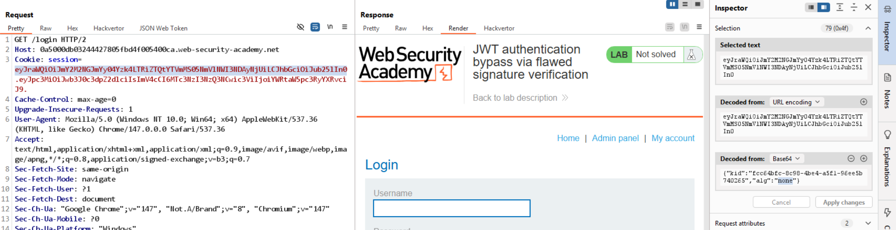

# Lab 2: JWT Authentication Bypass via Flawed Signature Verification

## Mục tiêu

Bypass xác thực JWT bằng cách ép server chấp nhận token `alg=none`, nâng quyền lên `administrator`, truy cập `/admin`, rồi xóa user `carlos`.

## Ý tưởng lỗi

Server xử lý thuật toán ký không chặt chẽ và chấp nhận token không chữ ký (`none`), dẫn tới bypass verify.

## Writeup từng bước: từ detect đến exploit

### Bước 1: Baseline để xác nhận có kiểm soát quyền

1. Đăng nhập account thường, gửi `GET /my-account` sang Repeater.
2. Đổi path thành `GET /admin` và gửi.
3. Quan sát bị từ chối.

### Bước 2: Detect hành vi verify sai

1. Decode JWT, đổi `sub` thành `administrator`, giữ `alg=RS256`.
2. Không ký lại token, gửi request.
3. Quan sát bị logout hoặc bị từ chối (server vẫn có kiểm chữ ký trong case này).



4. Tiếp tục đổi header `alg` thành `none`.
5. Giữ định dạng token không chữ ký:

```text
<header>.<payload>.
```

6. Gửi request với token mới.

Nếu vào được phiên hợp lệ hoặc truy cập tài nguyên đặc quyền, server đã chấp nhận `alg=none`.



### Bước 3: Exploit để solve lab

1. Dùng token `alg=none` với claim `sub=administrator` để truy cập `/admin`.
2. Gọi endpoint xóa user:

`/admin/delete?username=carlos`

3. Lab được solve.

## Vì sao detect này đáng tin cậy?

Bạn đã kiểm chứng theo chuỗi có kiểm soát:

1. Tamper payload với `RS256` thất bại.
2. Chỉ đổi sang `alg=none` thì thành công.

Điều này chỉ ra rõ lỗ hổng nằm ở logic chấp nhận thuật toán ký không an toàn.

## Gợi ý phòng thủ

1. Không bao giờ chấp nhận `alg=none` trong môi trường production.
2. Hardcode danh sách thuật toán cho từng issuer, không tin `alg` do client gửi.
3. Luôn yêu cầu chữ ký hợp lệ với thuật toán kỳ vọng.
4. Viết test bảo mật để chặn các case downgrade thuật toán.
