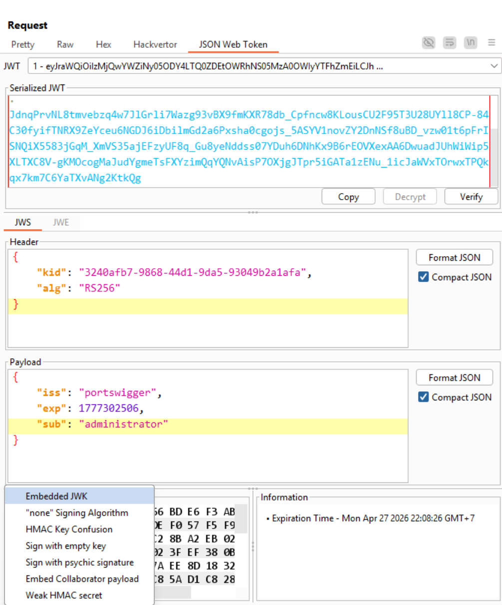
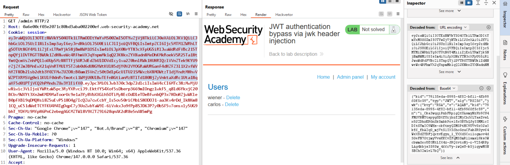

# Lab 4: JWT Authentication Bypass via `jwk` Header Injection

## Mục tiêu

Giả mạo JWT để nâng quyền thành `administrator`, truy cập `/admin`, sau đó xóa user `carlos`.

## Ý tưởng lỗi

Server tin khóa công khai được nhúng trực tiếp trong JWT header (`jwk`) thay vì chỉ tin key từ kho khóa phía server. Vì vậy attacker có thể tự tạo keypair, ký token bằng private key của mình, rồi cung cấp public key tương ứng ngay trong token.

## Writeup từng bước: từ detect đến exploit

### Bước 1: Baseline để xác nhận có kiểm soát quyền

1. Đăng nhập bằng tài khoản thường.
2. Gửi request `GET /my-account` sang Burp Repeater.
3. Đổi path thành `GET /admin` và gửi.
4. Quan sát bị từ chối truy cập.

### Bước 2: Detect dấu hiệu có thể dính `jwk` injection

1. Kiểm tra JWT header, xác định app dùng thuật toán bất đối xứng (thường là `RS256`).
2. Đặt giả thuyết: nếu server chấp nhận key từ header, có thể nhúng `jwk` do attacker kiểm soát.
3. Chuẩn bị test có kiểm soát bằng cách giữ nguyên luồng, chỉ thay đổi nguồn key verify.

### Bước 3: Chuẩn bị key và nhúng `jwk`

1. Trong JWT Editor, tạo một RSA key mới: `New RSA Key` -> `Generate`.
2. Quay lại request trong Repeater, sửa payload `sub` thành `administrator`.
3. Chọn `Attack` -> `Embedded JWK` để chèn public key vào header `jwk`.
4. Ký lại token bằng private key vừa tạo (alg `RS256`).

### Bước 4: Test xác nhận lỗ hổng

1. Gửi request đã sửa.
2. Nếu truy cập được `/admin`, lỗ hổng được xác nhận: server đang trust key từ `jwk` header.

### Bước 5: Exploit để solve lab

1. Trong admin panel, lấy endpoint xóa user:

`/admin/delete?username=carlos`

2. Gửi request tới endpoint trên để hoàn thành lab.

## Vì sao detect này đáng tin cậy?

Vì bạn chứng minh được chuỗi nguyên nhân - kết quả:

1. Account thường không có quyền admin.
2. Token chỉ thành công khi bạn nhúng key kiểm chứng do chính mình cung cấp.
3. Quyền được nâng thực sự và thực thi được hành động admin.

## Gợi ý phòng thủ

1. Không bao giờ trust `jwk` từ token nếu không có allowlist và ràng buộc nghiêm ngặt.
2. Chỉ verify JWT bằng key trong trust store phía server hoặc JWKS endpoint đã pin/allowlist.
3. Ràng buộc chặt thuật toán theo issuer, không cho algorithm agility tùy ý.
4. Validate đầy đủ claim quan trọng (`iss`, `aud`, `exp`, `nbf`, `iat`, `sub`).
5. Cảnh báo khi xuất hiện header JWT bất thường (`jwk`, `jku`, `x5u`, `kid` lạ).
