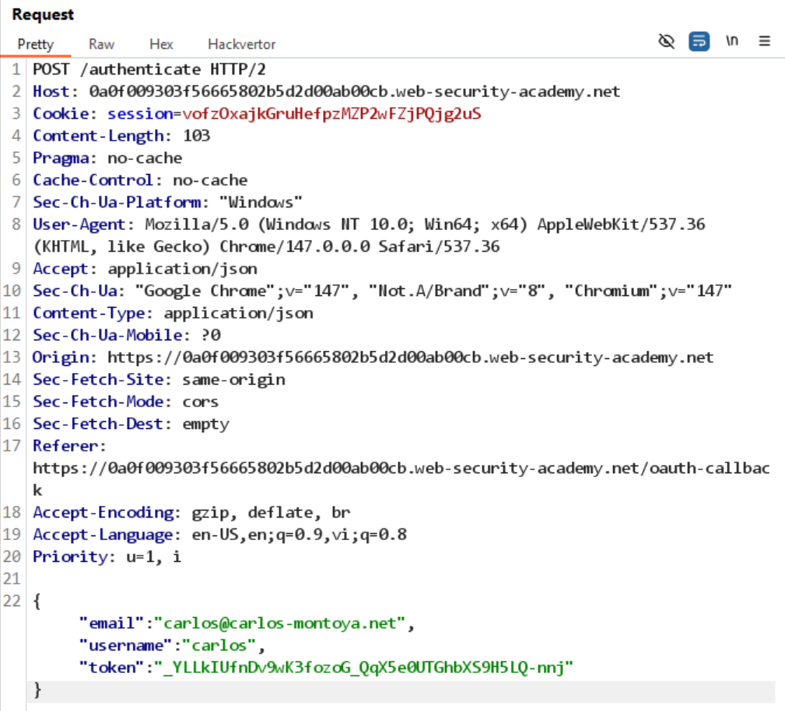

# Lab: Authentication bypass via OAuth implicit flow

**Mục tiêu:** Bypass xác thực bằng cách lợi dụng luồng OAuth implicit/flow không an toàn.

**Phát hiện (Detect)**

- Quan sát request `POST /authenticate` chứa các trường `email`, `username` và `token` (implicit token flow).
- Ứng dụng dường như chấp nhận token/credential được gửi trực tiếp trong request body.

**Khai thác (Exploit)**

- Intercept request `POST /authenticate` bằng proxy.
- Thay thông tin `email/username` bằng credential của `carlos` (hoặc giá trị attacker cần) và forward request.

**Kết quả**

- Sau thay đổi và gửi request, xác thực thành công với quyền của `carlos` → lab solved.

