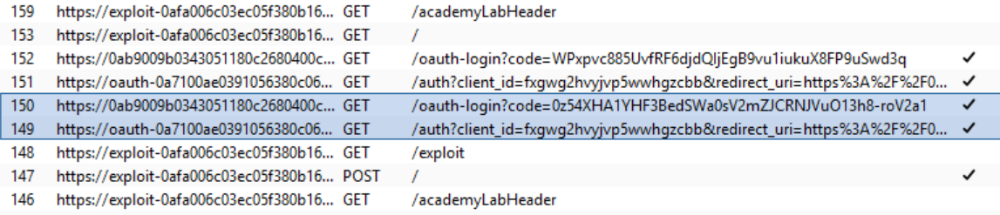
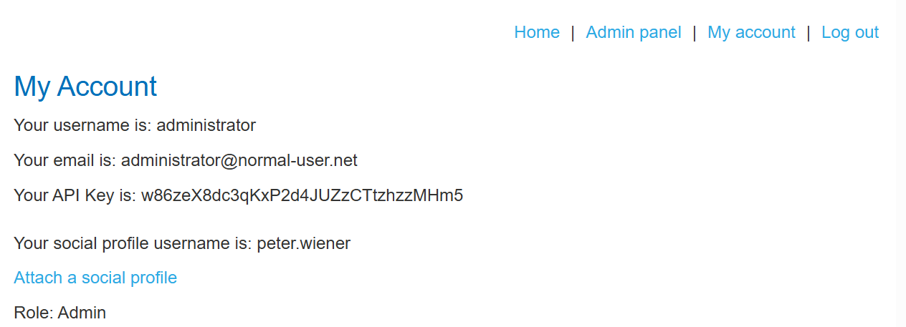

# Lab: Forced OAuth profile linking

**Mục tiêu:** Ép liên kết (link) tài khoản OAuth của victim vào account attacker bằng cách lạm dụng luồng linking thiếu bảo vệ (no state / CSRF).

**Phát hiện (Detect)**

- Sau khi init flow `Login with social media` thấy redirect về `/oauth-login?code=...` mà không kèm `state` → có thể CSRF/CSRF-like attack.
- Exchange code dẫn tới `/oauth-linking?code=...` endpoint dùng để kết nối profile.



**Khai thác (Exploit)**

- Lưu `code` chưa được sử dụng từ flow (drop request để giữ code).
- Dựng PoC trên exploit server: nhúng iframe tới URL `/oauth-linking?code=IVgshBH...` để khi victim mở iframe, flow linking sẽ chạy trong phiên họ.

```html
<iframe
  src="https://0ab9009b0343051180c2680400c10012.web-security-academy.net/oauth-linking?code=IVgshBH_wtV9xDdqcqE-IqxOEdPAZHV6dJKAEJ7wXBp"
></iframe>
```

**Kết quả**

- Sau deliver PoC và khi victim thực hiện `Login with social media`, session của victim bị link vào account attacker (administrator trong lab) → truy cập admin panel và xóa user `carlos`.



**Ghi chú:** Luồng OAuth liên kết phải kiểm tra `state` hoặc bước xác nhận user để ngăn kiểu tấn công này.
