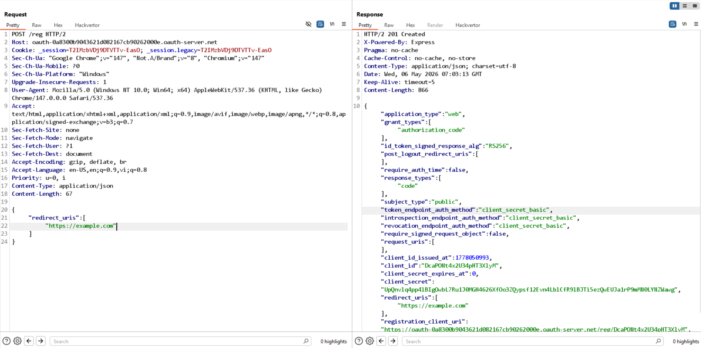

# Lab: SSRF via OpenID dynamic client registration

Truy cập thử https://oauth-0a8300b9043621d082167cb90262000e.oauth-server.net/.well-known/openid-configuration và lấy được openid configuration, trong đó có phần   "registration_endpoint": "https://oauth-0a8300b9043621d082167cb90262000e.oauth-server.net/reg".

Thử đăng ký 1 client mới với endpoint trên, set redirect_uris bát kỳ (`https://example.com`):

-> nhận thấy, hệ thống không validate redirect_uris và có cung cấp "client_id":"DcaPONt4x2U34pHT3XlyM"

