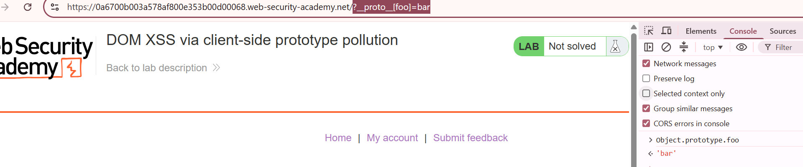
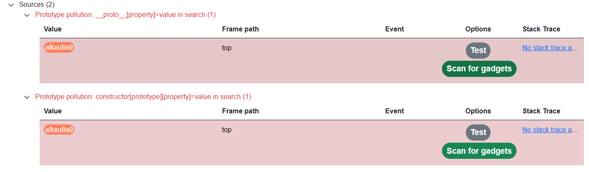
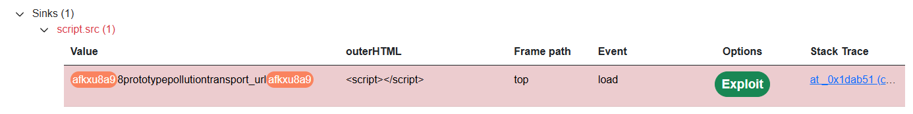
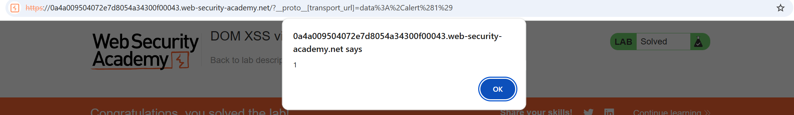

# Lab: DOM XSS via client-side prototype pollution

## Manual solution

Thử chèn `/?__proto__[foo]=bar` vào URL, sau đó kiểm tra trong console:


-> Xác nhận trang có thể bị prototype pollution.

Kiểm tra mã nguồn, thấy có 2 file JS liên quan:

1. `/resources/js/deparam.js`:

```javascript
var deparam = function (params, coerce) {
  var obj = {},
    coerce_types = { true: !0, false: !1, null: null };

  if (!params) {
    return obj;
  }

  params
    .replace(/\+/g, " ")
    .split("&")
    .forEach(function (v) {
      var param = v.split("="),
        key = decodeURIComponent(param[0]),
        val,
        cur = obj,
        i = 0,
        keys = key.split("]["),
        keys_last = keys.length - 1;

      if (/\[/.test(keys[0]) && /\]$/.test(keys[keys_last])) {
        keys[keys_last] = keys[keys_last].replace(/\]$/, "");
        keys = keys.shift().split("[").concat(keys);
        keys_last = keys.length - 1;
      } else {
        keys_last = 0;
      }

      if (param.length === 2) {
        val = decodeURIComponent(param[1]);

        if (coerce) {
          val =
            val && !isNaN(val) && +val + "" === val
              ? +val // number
              : val === "undefined"
                ? undefined // undefined
                : coerce_types[val] !== undefined
                  ? coerce_types[val] // true, false, null
                  : val; // string
        }

        if (keys_last) {
          for (; i <= keys_last; i++) {
            key = keys[i] === "" ? cur.length : keys[i];
            cur = cur[key] =
              i < keys_last
                ? cur[key] || (keys[i + 1] && isNaN(keys[i + 1]) ? {} : [])
                : val;
          }
        } else {
          if (Object.prototype.toString.call(obj[key]) === "[object Array]") {
            obj[key].push(val);
          } else if ({}.hasOwnProperty.call(obj, key)) {
            obj[key] = [obj[key], val];
          } else {
            obj[key] = val;
          }
        }
      } else if (key) {
        obj[key] = coerce ? undefined : "";
      }
    });

  return obj;
};
```

2. `/resources/js/searchLogger.js`:

```javascript
async function logQuery(url, params) {
  try {
    await fetch(url, {
      method: "post",
      keepalive: true,
      body: JSON.stringify(params),
    });
  } catch (e) {
    console.error("Failed storing query");
  }
}

async function searchLogger() {
  let config = { params: deparam(new URL(location).searchParams.toString()) };

  if (config.transport_url) {
    let script = document.createElement("script");
    script.src = config.transport_url;
    document.body.appendChild(script);
  }

  if (config.params && config.params.search) {
    await logQuery("/logger", config.params);
  }
}

window.addEventListener("load", searchLogger);
```

`searchLogger.js` dùng `transport_url` từ `config` để gán vào `src` của thẻ `script`, nên nếu điều khiển được giá trị này thì có thể dẫn đến DOM XSS.

Thử với:

```
/?__proto__[transport_url]=data:,alert(1);//
```

## DOM Invader solution

Bật DOM Invader, sau đó reload page.

F12 mở tab "DOM Invader", thấy phát hiện được 2 source:


Chạy `Scan for gadgets`:


Click `Exploit`, alert hiện ra và lab được solved:

