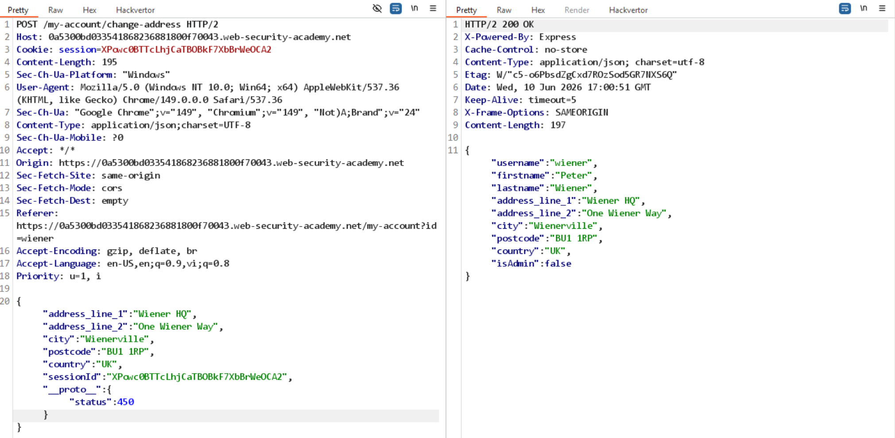
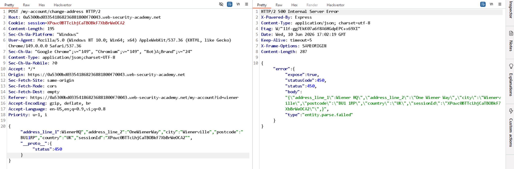

# Lab: Detecting server-side prototype pollution without polluted property reflection

Thử thêm thuộc tính `__proto__` vào JSON, không thấy reflect:

-> Thử trigger lỗi bằng cách xóa 1 dấu `"` nào đó, đồng thời thêm `__proto__` vào JSON:

