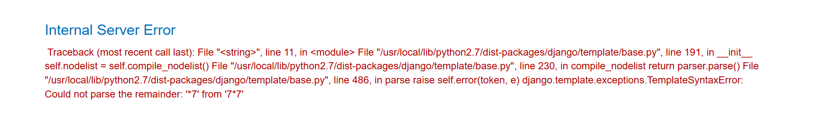
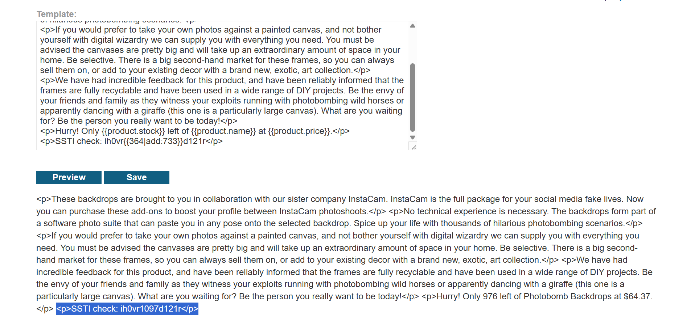
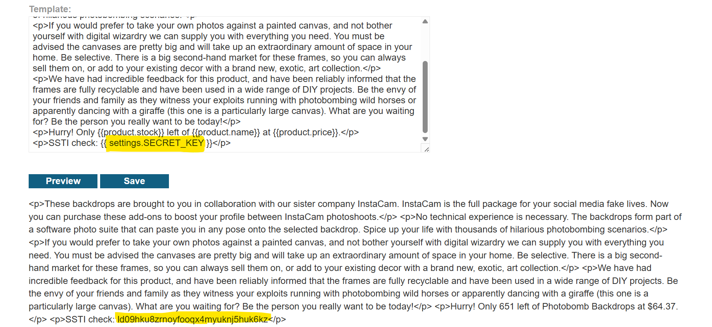

# Lab: Server-side template injection in an unknown language with information disclosure

## Mục tiêu

Nhận diện Django template, dùng `debug` để tìm object khả dụng, rồi lấy `settings.SECRET_KEY` để solve lab.

## Ý tưởng lỗi

Template cho phép evaluate expression của Django. Khi xác định được engine, ta có thể dùng built-in debug để enumerate context, rồi trích xuất biến nhạy cảm như `SECRET_KEY`.

## Writeup từng bước: từ detect đến exploit

### Bước 1: Detect Django template

1. Chèn payload thử nghiệm vào template:

`
SSTI check: {{7*7}}
`

2. Trang trả về lỗi, xác định Django template.
3. Thử thêm payload có filter:

`ih0vr{{364|add:733}}d121r`

4. Nhận được `ih0vr1097d121r`, xác nhận đây là Django template và expression/filter đang hoạt động.

### Bước 2: Tìm cách đọc context

1. Thử tham chiếu tới object liên quan signer/key:

`{{ messages.storages.0.signer.key }}`

2. Không có output hữu ích, chuyển sang hướng enumerate context bằng built-in debug.

### Bước 3: Khai thác để đọc SECRET_KEY

1. Trong Django docs, dùng built-in template tag:

``

2. Output sẽ liệt kê các object và biến có thể truy cập từ template.
3. Từ đó, xác định có thể truy cập `settings`.
4. Đọc secret key trực tiếp bằng:

`{{ settings.SECRET_KEY }}`

5. Ghi lại giá trị trả về và submit để solve lab.

## Vì sao detect này đáng tin cậy?

`{{7*7}}` và `{{364|add:733}}` chứng minh template đang evaluate expression theo Django semantics. Sau đó `` cho thấy context object, nên việc đọc `settings.SECRET_KEY` là bước leo thẳng từ enumerate sang info disclosure.

## Gợi ý phòng thủ

1. Không để template lộ context debugging trong production.
2. Không đưa object cấu hình nhạy cảm vào template context nếu không cần.
3. Tách dữ liệu hiển thị khỏi biến hệ thống như `SECRET_KEY`.
