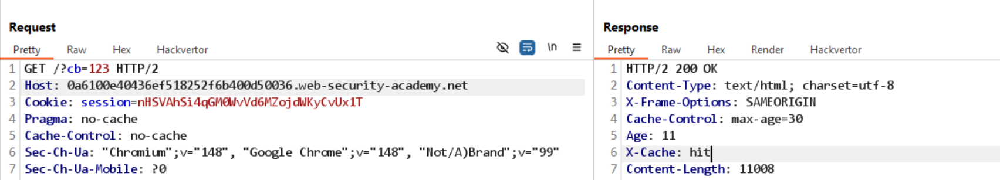
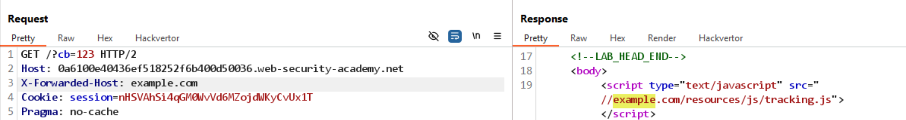
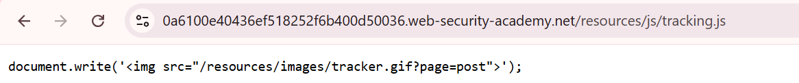
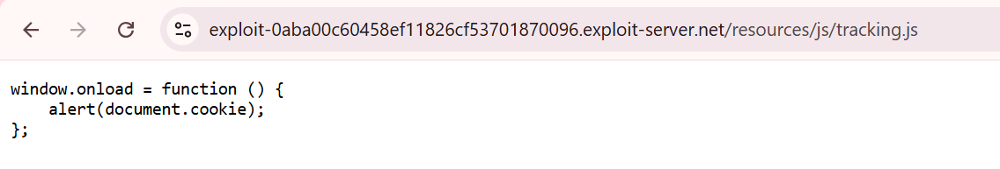
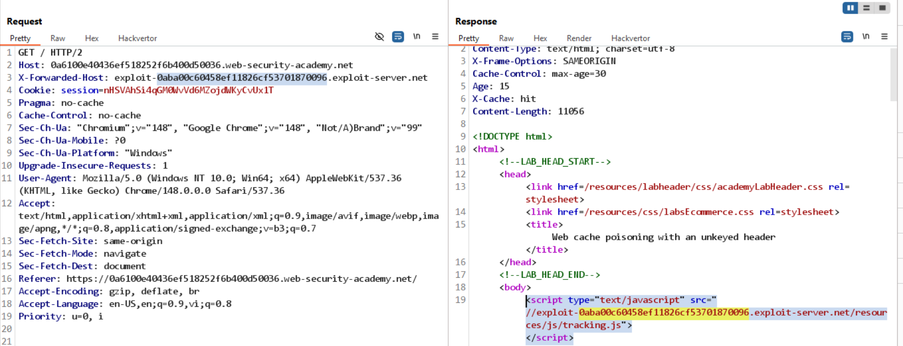

# Bài lab: Web cache poisoning qua header không được khóa

Mục tiêu: Thực hành tấn công web cache để chèn payload vào nội dung được cache bằng cách lợi dụng header không được khóa.

## Phát hiện

- Thêm tham số `?cb=123` vào URL và quan sát header `X-Cache: hit`, cho thấy nội dung được cache.
- Thử thêm header `X-Forwarded-Host` trỏ tới exploit server; giá trị này xuất hiện trong phản hồi, chứng tỏ nó được phản chiếu.
  
  

## Kiểm tra file `tracking.js`

File `tracking.js` gốc được phục vụ từ server và có thể bị thay thế để phục vụ payload:

## Chuẩn bị exploit

- Cập nhật exploit server để trả về tập tin `/resources/js/tracking.js` chứa mã thực thi (ví dụ `alert(document.cookie)`).
  

## Tạo cache

- Gửi nhiều yêu cầu `GET /` (hoặc gửi yêu cầu với header tương tự) để nội dung exploit được lưu vào cache của server.
  

## Kết quả

- Payload được phục vụ từ cache và có thể thực thi trên trình duyệt nạn nhân — lab solved.
