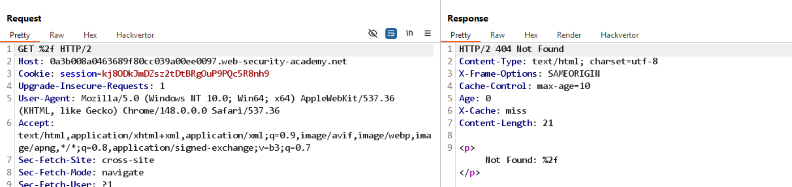
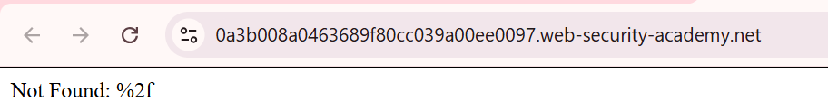
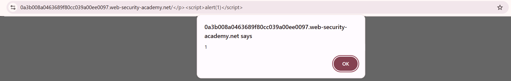

# Lab: URL normalization

Thử Param Miner -> `Guess everything!` nhưng không tìm thấy query/header nào dùng được.

Thử khai thác URL normalization, đổi `/` thành `%2f`.


thấy `cache hit`, khi truy cập lại Home thì response đã bị ảnh hưởng:


-> có sai khác normalize URL giữa cache và backend, khai thác được cache poisoning

Đổi payload thành:

```
/</p><script>alert(1)</script>
```



-> deliver to victim, Lab solved
