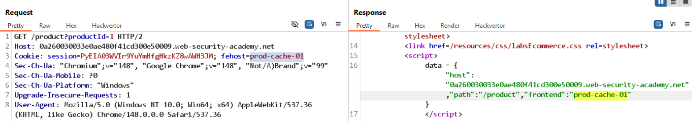
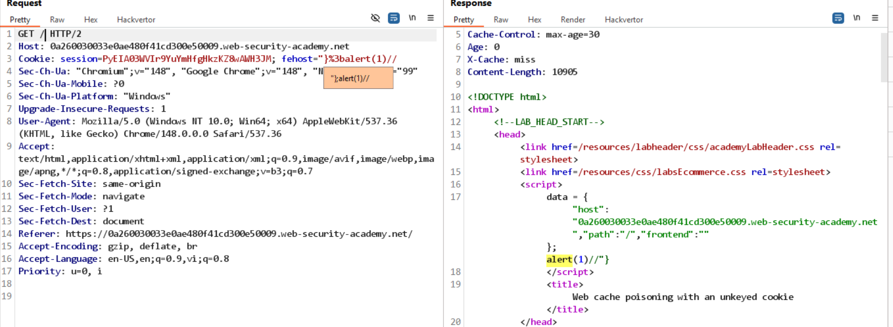

# Bài lab: Web cache poisoning qua cookie không được khóa

Mục tiêu: Khai thác cookie không được khóa để chèn payload vào nội dung được cache và phục vụ cho nạn nhân.

## Phát hiện

- Gửi nhiều yêu cầu và quan sát header `X-Cache: hit`, cho thấy server sử dụng cache.
- Phát hiện cookie `fehost=prod-cache-01` và có đoạn mã phía client/server sử dụng giá trị này trong phản hồi.
  

## Khai thác

- Thay đổi giá trị `fehost` (ví dụ `"}%3balert()`) và gửi lặp lại yêu cầu để nội dung chứa payload được lưu vào cache.
  

## Kết quả

- Payload đã được phục vụ từ cache thành công và có thể thực thi trên trình duyệt nạn nhân.
