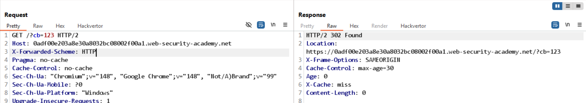
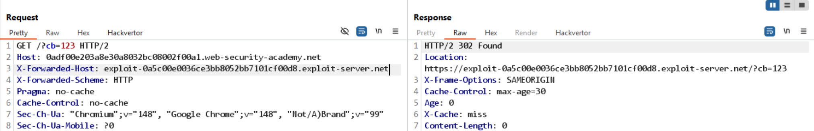
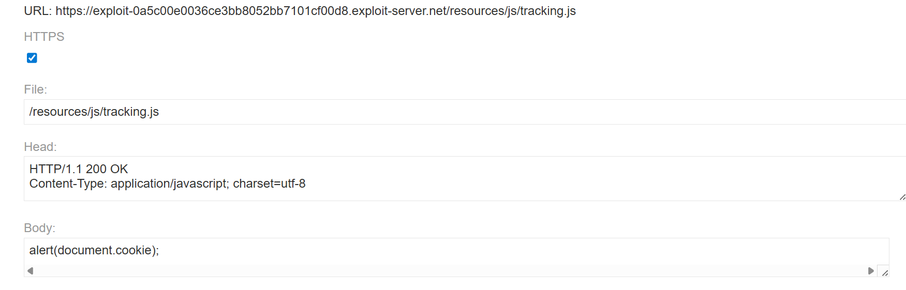
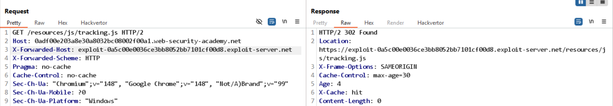

# Bài lab: Web cache poisoning bằng cách thao tác nhiều header

Mục tiêu: Lợi dụng nhiều header để khiến cache phục vụ payload từ exploit server.

## Phát hiện

- Thêm header `X-Forwarded-Scheme: HTTP` và quan sát server chuyển hướng khác so với mặc định.
  

- Thêm header `X-Forwarded-Host` trỏ tới exploit server, server redirect về host đó, báo hiệu khả năng phản chiếu host.
  

## Chuẩn bị payload

- Chuẩn bị exploit server trả về đoạn mã thực thi (ví dụ `alert(document.cookie)`) tại đường dẫn `/resources/js/tracking.js`.
  
  

## Kết quả

- Payload được phục vụ từ exploit server thông qua cache và có thể thực thi trên trình duyệt nạn nhân.
