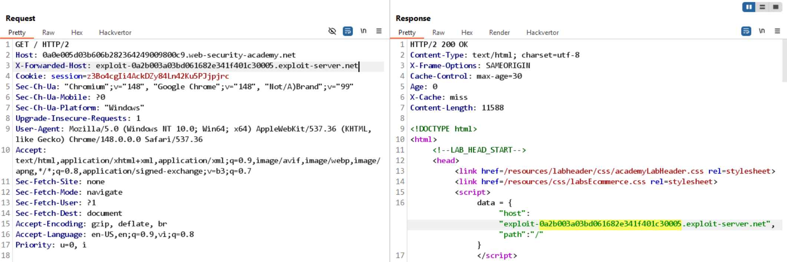
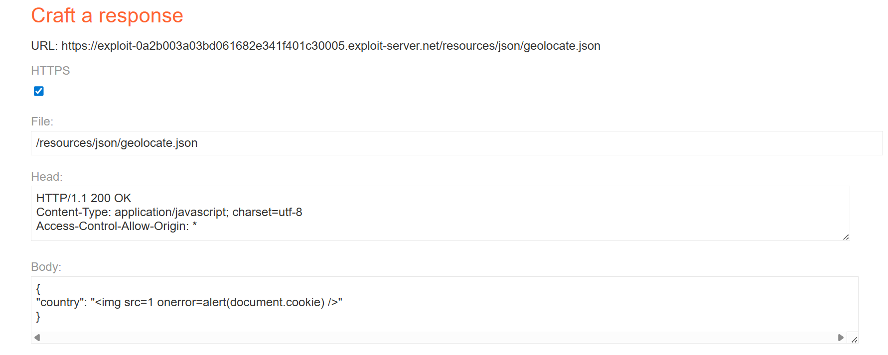

# Bài lab: Web cache poisoning kết hợp khai thác lỗ hổng DOM với tiêu chí cache chặt

## Phát hiện

- Thêm header `X-Forwarded-Host` và nhận thấy giá trị này được phản chiếu trong phản hồi.
  

## Phân tích

- Trang chủ tạo URL cho tài nguyên geolocation dựa trên `data.host`:

```
<script>
    initGeoLocate('//' + data.host + '/resources/json/geolocate.json');
</script>
```

- Do đó cần cấu hình exploit server trả về tài nguyên tại `/resources/json/geolocate.json` để kiểm soát dữ liệu trả về.

## Nội dung `geolocate.json` (ý tưởng)

```
function initGeoLocate(jsonUrl)
{
    fetch(jsonUrl)
        .then(r => r.json())
        .then(j => {
            let geoLocateContent = document.getElementById('shipping-info');

            let img = document.createElement("img");
            img.setAttribute("src", "/resources/images/localShipping.svg");
            geoLocateContent.appendChild(img)

            let div = document.createElement("div");
            div.innerHTML = 'Free shipping to ' + j.country;
            geoLocateContent.appendChild(div)
        });
}
```

## Khai thác DOM XSS

- Vì `jsonUrl` và nội dung `j.country` có thể kiểm soát được, tồn tại nguy cơ DOM XSS nếu trả về chuỗi chứa HTML/JS.
- Trên exploit server, phục vụ `geolocate.json` với header `Access-Control-Allow-Origin: *` và nội dung ví dụ:

```
{
    "country": ""
}
```



## Kích hoạt payload

- Lưu nội dung độc hại trên exploit server và reload trang Home để nạn nhân tải tài nguyên từ cache, dẫn tới thực thi payload.
  
