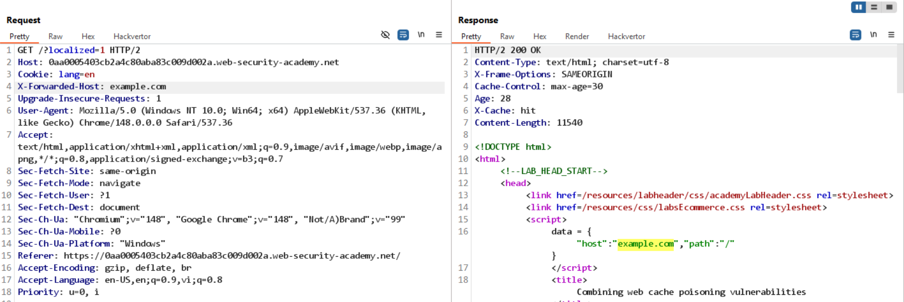
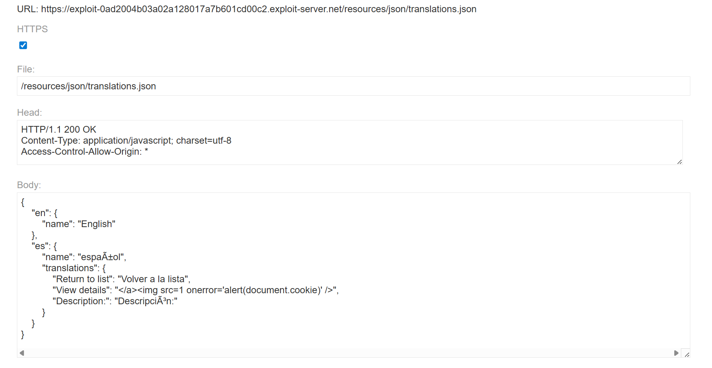
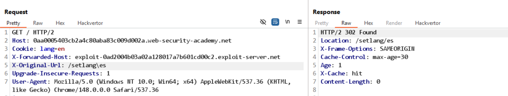

# Bài lab: Kết hợp các lỗ hổng web cache để khai thác DOM

## Phát hiện

- Phát hiện server sử dụng cache và phản chiếu header `X-Forwarded-Host` trong phản hồi.
  

- Mã nguồn chèn đường dẫn tới tập tin dịch thuật dựa trên `data.host`:

```
<script>
    initTranslations('//' + data.host + '/resources/json/translations.json');
</script>
```

=> Cần cấu hình exploit server trả về `/resources/json/translations.json`.

## Nội dung mẫu `translations.json`

```
{
    "en": { "name": "English" },
    "es": {
        "name": "español",
        "translations": {
            "Return to list": "Volver a la lista",
            "View details": "Ver detailes",
            "Description:": "Descripción:"
        }
    },
    "cn": { "name": "中文", "translations": { "Return to list": "返回清單", "View details": "查看詳情", "Description:": "描述:" } }
}
```

## Phân tích file `translations.js`

```
function initTranslations(jsonUrl) { ... }
```

- Đoạn mã sử dụng `j[lang].translations` và gán `el.innerHTML = dict[k]`, nên nếu `dict[k]` chứa HTML/JS thì có nguy cơ XSS.

## Chuẩn bị payload

- Vì trang có thẻ `<a class="button" href="/product?productId=1">View details</a>`, payload dịch thuật cần đóng thẻ `a` và chèn thẻ `img` để kích hoạt XSS:

```
{
  "en": { "name": "English" },
  "es": {
    "name": "español",
    "translations": {
      "Return to list": "Volver a la lista",
      "View details": "</a>",
      "Description:": "Descripción:"
    }
  }
}
```



## Vấn đề còn thiếu

- Mặc dù đã thay `translations.json`, payload chưa được thực thi vì nạn nhân vẫn đang dùng ngôn ngữ mặc định `en`.

## Ép đổi ngôn ngữ và cache chain

- Mã chọn ngôn ngữ:

```
<form>
  <select id=lang-select onchange="((ev) => { ev.currentTarget.parentNode.action = '/setlang/' + ev.target.value; ev.currentTarget.parentNode.submit(); })(event)">
  </select>
</form>
```

- Sử dụng header `x-original-url` để cache đường dẫn `/setlang/es` (ví dụ `//setlang\es` hoặc `/setlang/es//`) dẫn tới việc khi reload Home nạn nhân sẽ bị redirect sang `/?localized=1` và sử dụng ngôn ngữ `es`.
  

- Gửi đồng thời hai yêu cầu thích hợp để tạo chuỗi cache (cache chain) và kích hoạt XSS — lab solved.
